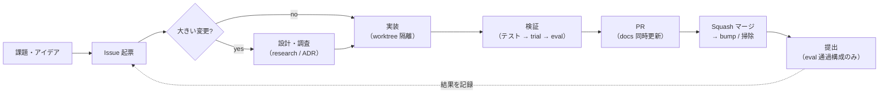

# 開発プロセスガイド

チーム（人間と Claude セッションの両方）が同じやり方で開発を回すための規約。
ここが**プロセスの正**であり、`CLAUDE.md` はこの文書の要約 + Claude への強制事項に位置づける。
操作手順そのもの（build → dev → trial → down）は [beginner-deck.marp.md](beginner-deck.marp.md) を参照。

## 0. 全体像



### 情報の三層（どこに何を書くか）

| 層 | 置き場 | 書くもの |
|---|---|---|
| **現状** | 各リポジトリの `docs/`（例: mpc の `architecture.md` / `parameters.md`） | 「今どうなっているか」。挙動を変える PR と同時に更新する |
| **決定** | `docs/adr/`（主に mpc） | 「なぜそう決めたか」。不可逆 × 文脈なしでは不可解 × 実トレードオフ、の 3 条件が揃った決定だけ |
| **経緯** | GitHub Issue のコメント | 検証結果・実験ログ・議論。「現状の説明」を Issue に書かない（腐るため） |

### リポジトリの役割

| リポジトリ | 公開 | 置くもの |
|---|---|---|
| aichallenge-racingkart（本体） | public | 構成・インフラ・launch・bump。**Issue/PR/コミットは無難な内容のみ** |
| multi_purpose_mpc_ros_custom（mpc） | private | 制御の実装・機構詳細・ADR・research・戦略に触れる議論 |
| racingkart-analysis | — | 解析・評価ツール |
| racingkart-results | — | 提出台帳・ダッシュボード |

## 1. チケットと設計

- やりたい作業は **Issue として起票**する。変更が入るリポジトリに立てる（リポジトリ横断は本体に立てて相互リンク）。機構の詳細・レース戦略に踏み込む内容は private 側（mpc）に立てる
- 粒度: **まとまった作業 = 1 Issue + 複数 PR**（途中は `Refs #N`、最後の PR で `Closes #N`）。細かく割りすぎない
- 日付付きの詳細設計書は**ローカル作業ファイル**（`docs/plan/` 等、gitignore 済み）。コミットせず、設計書だけの PR は作らない。共有・記録は Issue コメントか現状ドキュメントの更新で行う
- 外部調査（文献・実装サーベイ）は mpc の `docs/research/` に日付つきで恒久保存し、ADR から根拠として引用できるようにする
- 大きな設計判断をしたら ADR に 1〜3 文で記録する（基準・形式は mpc の `docs/adr/README.md`）

## 2. 実装

- 実装は **git worktree**（`.claude/worktrees/`）で隔離し、共有チェックアウト・他の作業中ブランチに影響を与えない
- Root branch: 本体 = `develop`、mpc = `main`。**着手前に origin を fetch して最新から分岐**する（ローカルが遅れていることがある）
- submodule の変更は submodule のリポジトリで PR を出し、マージ後に本体で bump PR を出す
- コミットは Conventional Commits（prefix は英語）。本体はコミット前に `pre-commit run -a` を必ず通す
- 言語: コード内コメント = 英語 / コミット = 英語 / PR 本文・Issue = 日本語

## 3. 検証

- 検証・実験の手順を独自に組む前に、[beginner-deck.marp.md](beginner-deck.marp.md) と `utils/` の既存手段を確認する
- 検証の階層（下に行くほど重い。変更のリスクに応じて選ぶ）:

| レベル | 手段 | 使いどころ |
|---|---|---|
| 1 | 単体テスト（純 Python モジュール） | 全変更 |
| 2 | 実ソルバー・スモークテスト | QP/経路まわりの変更 |
| 3 | `make trial`（ソロ 6 周） | 挙動を変える変更のマージ前（1〜2 周の trial-quick は確率的事象を見逃すため正式判定に使わない） |
| 4 | `make trial3`（混走） | 追い越し・多車両系の変更 |
| 5 | `make eval` | 提出前の最終検証。**提出するのは eval で動いた構成のみ** |

- **sim 実行時の注意（DDS 混線防止）**: 同一ホストの sim は DDS ドメインを共有しており、同時実行するとデータ・制御が壊れる。起動直前に `docker ps` で他の sim が動いていないことを確認してから起動し（確認は「値で分岐して起動を止める」形にする）、実行中も他プロジェクトのコンテナ混入を監視、混入したら自分の run を止める。結果が異常（ラップゼロ・NaN・異常速度）ならまず同時実行を疑う
- 検証の結果・ログ・判断は対応 Issue のコメントに記録する。`make eval` は解析と MLflow push まで自動で行う

## 4. PR

- PR 前に `git rebase origin/develop`（本体）/ `git rebase origin/main`（mpc）
- PR 本文は日本語テンプレート（変更内容 / 変更の理由 / 確認事項 / 備考）。対応 Issue を必ず参照する（`Closes #N` / `Refs #N`）
- **挙動を変える PR は、現状ドキュメントの該当節（mpc なら `architecture.md` / `parameters.md`）を同じ PR で更新する**
- レビュアーは特に指定しない（見てほしい相手がいれば都度指定する）
- マージは **Squash and Merge** のみ。マージ後はブランチを削除する

## 5. マージ後

- submodule の変更をマージしたら、本体の bump PR を出す
- worktree とローカル計画書を掃除する（**未実装の計画は worktree 削除に巻き込まで消さない**）
- Issue をクローズする前に「現状ドキュメントへ反映済みか」を確認する
- `main` は upstream 同期用（`gh repo sync`）。**upstream（公式）への push は絶対にしない**。gh の書き込み操作は常に `--repo` を明示する

## 6. 提出

- 提出するのは `make eval` で動いた構成のみ（`make dev` の結果だけで提出しない）
- 提出は `./submit_from_mpc.bash <mpc-commit> -p "目的"` の 1 コマンド
  （隔離 worktree で tar 生成・MLflow 事前登録 → 確認プロンプト → アップロード → 台帳記帳）
- **エージェントが提出を実行してよいのは、人間がその提出を明示的に依頼した時だけ**
  （提出は 1 日 10 回の評価枠を消費する。自律的・先回り・定期実行での提出は禁止。
  実行時は `--dry-run` でサマリーを確認・報告してから本番を実行する）
- 提出後: 評価完了を待って以下を実行（結果・rosbag の取得と MLflow への
  追記まで自動。手動フォールバックは `docs/spec/submission-tracking.md` 参照）

  ```bash
  cd racingkart-analysis
  make sync-board
  ```

## 7. ツール・エージェントの運用

- **superpowers 等のスキルは任意**。明示的に依頼された時か、有用と判断して一言添えて使う時だけ使う。スキルを使わないことは違反ではない
- 並行する Claude セッション・チームメイトの作業を邪魔しない: sim の同時実行禁止（§3）に加え、ビルド等の高負荷作業もチェーンの各段直前に `docker ps` / `uptime` で競合を確認する
- ドキュメントの三層（§0）を守る: 会話やセッション内で確定した「現状」「決定」は、セッション終了前にしかるべき層へ書き出す
