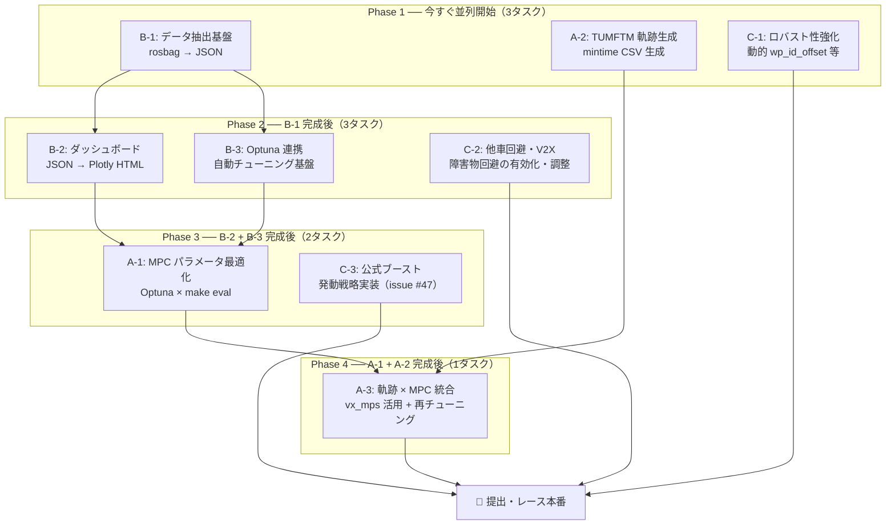
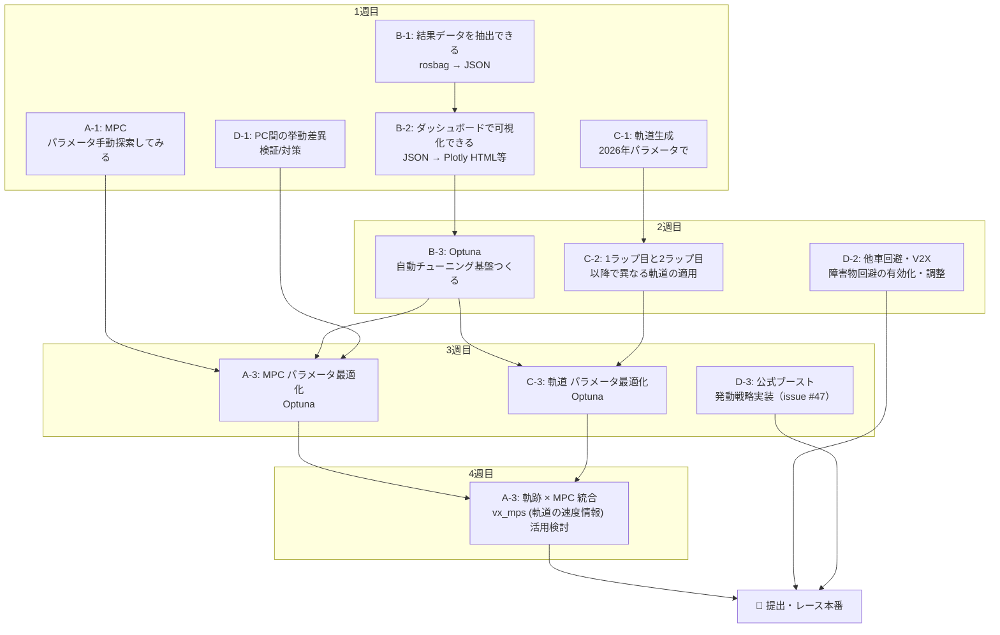

# 自動運転AIチャレンジ（レーシングカート SW部門）戦略文書

> 仕様ドキュメント（現仕様の正）。最終確認: 2026-07-08。文書運用方針は [docs/README.md](../README.md) を参照。

## 目次

1. [競技の理解](#1-競技の理解)
   - 1.1 競技形式
   - 1.2 スコアリングと勝敗条件
   - 1.3 提出の制約
   - 1.4 ペナルティルール
2. [現状の把握](#2-現状の把握)
   - 2.1 実装済み機能の全体像
   - 2.2 MPC の仕組み（LTV-MPC + OSQP）
   - 2.3 参照経路（最小曲率ライン）
   - 2.4 障害物回避・V2X追跡（実装済み・無効）
   - 2.5 ブースト加速
   - 2.6 現在のラップタイム実績とボトルネック
3. [速度・ラップタイム改善](#3-速度ラップタイム改善)
   - 3.1 MPCパラメータチューニング
   - 3.2 レーシングライン最適化（TUMFTM mintime）
   - 3.3 速度プロファイルの活用（vx_mps を MPC に渡す）
   - 3.4 セクション別速度設定（ref_vel.yaml）
   - 3.5 Lap1 vs Lap2 以降の戦略
   - 3.6 縦方向制御の改善計画（mintime → 摩擦円 → 速度レート制約）
4. [レース戦略](#4-レース戦略)
   - 4.1 他車との衝突回避（V2X + 障害物回避有効化）
   - 4.2 公式ブーストの発動戦略
   - 4.3 追い越し・逃げ切りの判断
   - 4.4 予選と決勝での戦略の違い
5. [評価フレームワーク](#5-評価フレームワーク)
   - 5.1 評価指標の定義
   - 5.2 評価ダッシュボードの設計
   - 5.3 ローカル評価環境（make eval）の位置づけ
   - 5.4 提出先 rosbag とローカルの差異
6. [最適化ループ](#6-最適化ループ)
   - 6.1 パラメータ最適化の方針
   - 6.2 Optuna による自動チューニング
   - 6.3 提出サーバーを使ったループ設計
   - 6.4 半自動化パイプライン
7. [ロバスト性・信頼性](#7-ロバスト性信頼性)
   - 7.1 waypoint探索のロバスト性（ループジャンプ対策）
   - 7.2 ハードウェア差への対応（動的 wp_id_offset）
   - 7.3 計算時間の監視とフォールバック
   - 7.4 make eval での最終検証フロー
8. [実装ロードマップ](#8-実装ロードマップ)
   - 8.1 即できること（設定変更のみ）
   - 8.2 短期（〜1週間）
   - 8.3 中期（〜1ヶ月・提出開始まで）
   - 8.4 提出開始後のループ運用

---

## 1. 競技の理解

### 1.1 競技形式

本競技はシミュレータ（AWSIM）上のCCTBコースを舞台とした自動運転レースである。

| 項目 | 予選（SIM） | 決勝（SIM） |
|------|------------|------------|
| 参加台数 | 3台（チャレンジャー + ランク近接チーム1台 + 運営NPC1台） | 4台（チャレンジャー + 他チーム3台、NPCなし） |
| 環境 | AWSIM シミュレータ / CCTBコース | 同左 |
| 周回数 | 6周 | 6周 |
| タイムリミット | 10分 | 10分 |

- **予選**はランキング近接チームおよび運営NPCとの3台レースで実施される
- **決勝**はNPCが存在せず、純粋に他チーム3台との実力勝負となる
- タイムアタック形式ではなく、**完走順位**が結果を決定する

### 1.2 スコアリングと勝敗条件

勝敗はランキングポイントの増減で管理される。

```
自チームが提出
  → 対戦相手として選ばれた別チームのレースに自動的にエントリー
  → レース実施
  → 1位完走（勝利）→ ランク上昇
  → 敗北 or NPC勝利 → ランク下降 or 維持
```

**重要な特性:**

- 「勝利」の定義は**1位完走**であり、タイムではなく順位が全て
- 自分がNPCに負けた場合もランク下降の対象となる（予選）
- 決勝ではNPCが存在しないため、他チーム3台全てに先行する必要がある
- 提出後、相手チームのレースに登録されるため、提出頻度が試合数に直結する

### 1.3 提出の制約

#### 提出対象ディレクトリ

```
aichallenge/workspace/src/aichallenge_submit/
```

このディレクトリ配下のパッケージのみが提出・変更可能。主な含有物：

| パッケージ / ファイル | 用途 |
|----------------------|------|
| `multi_purpose_mpc_ros/` | MPC制御本体 |
| `multi_purpose_mpc_ros/config/config.yaml` | 制御パラメータ設定 |
| `multi_purpose_mpc_ros/env/*/traj_*.csv` | 参照軌跡CSV |
| `aichallenge_submit_launch/launch/` | launchファイル群 |
| `simple_pure_pursuit/` | Pure Pursuit制御 |
| `tiny_lidar_net_controller/` | E2Eニューラルネット制御 |

**変更不可:** `aichallenge_system/`（AWSIM設定、センサー定義等）

#### 提出手順

```bash
./create_submit_file.bash    # → tar.gz 生成
# → 大会Webサイトにアップロード
```

#### 提出制約

- **1日あたり約20回**の提出上限
- 提出サイトは**大会開始1ヶ月後にオープン**
- 提出後は**結果rosbagをダウンロード**可能（デバッグに活用）

### 1.4 ペナルティルール

公式アナウンス（2026-07-07、運営の Slack 共有。記録は issue #46 クローズコメント）で数値付きに確定した。違反対象は「衝突」と「不正」の 2 点のみに絞られている。

| 種別 | 条件 | ペナルティ |
|------|------|-----------|
| CRASH | 前方車リアバンパー×後方車フロントバンパーの接触 | **後方車**が 10 秒間 最大 5 km/h |
| WALL | 壁への衝突 or コースアウト | 5 秒間 最大 5 km/h |
| OVER | 加速度入力 ±3 m/s² 超 **or** 加速度を 250 Hz 以上で publish | 2 秒間 最大 5 km/h |

補足（アナウンスの背景説明より）:

- **AWSIM 入力段で加速度は ±1.37 m/s² に clamp** される。1.37〜3 m/s² の入力はペナルティにならないが効かない「実質無意味」な入力（→ a_max の合法上限は 1.37）。**7/1 版バイナリでは clamp ±1.37 が実際に効く**（ステップ実験: 指令 1.37 → 実加速 +0.76、2.0 で頭打ち。issue #67）。旧 5/31 版の「指令 ±約1.0 で飽和」（issue #53）は旧バイナリ限定の挙動だった
- 「フラフラ走行」は、他車妨害の意図的戦略と運営が判断した場合のみ対応検討
- CRASH は追突した**後方車**側のペナルティ。FOLLOW・追い越し戦略の車間設計に直結する（§4.3）
- **WALL ペナルティは 7/1 版バイナリで発動を実測確認済み**（issue #67）: bag 上は「27 km/h → 数 km/h への物理的にありえない急減速 + 低速持続 5.3 秒」の署名で現れる。**result 系の penalty カウンタは 0 のまま**なので、検出は bag の速度急落署名で行うこと（racingkart-analysis にメトリクス追加予定）

**衝突ペナルティは「完走順位」に直結するため最重要課題。**
速度制限ペナルティが発動すると順位が大幅に下落するリスクがある。完走・無衝突を最優先とする戦略が基本方針となる。

---

## 2. 現状の把握

### 2.1 実装済み機能の全体像

提出可能パッケージの実装状態と有効/無効の現状：

| パッケージ | 機能 | 実装状態 | デフォルト |
|-----------|------|----------|-----------|
| `multi_purpose_mpc_ros` | MPC制御（40Hz、LTV-MPC + OSQP） | 完成 | **有効** |
| `simple_pure_pursuit` | Pure Pursuit制御 | 完成 | 無効 |
| `tiny_lidar_net_controller` | E2Eニューラルネット制御 | 完成 | 無効 |
| `boost_commander.cpp` | ブースト加速制御（C++） | 完成 | 無効 |
| `path_constraints_provider` | 経路制約プロバイダ | 完成 | 無効 |
| `v2x_vehicle_tracker.py` | V2X他車追跡 | 完成 | 有効（未活用） |
| `gyro_odometer`, `imu_corrector`, `imu_gnss_poser` | 自己位置推定 | 完成 | 有効 |

**未実装:**
- 公式ブーストの発動戦略（5回×10秒、issue #47。§2.5/§4.2）
- 積極的追い越し戦略
- 衝突後自動リカバリ

### 2.2 MPC の仕組み（LTV-MPC + OSQP）

#### アーキテクチャ概要

```
センサ入力（GNSS, IMU, オドメトリ）
  → 自己位置推定
  → 参照軌跡CSVから最近傍ウェイポイントを検索
  → LTV-MPC（線形時変二次計画問題）をOSQPで解く
  → 速度・ステア角指令をAWSIMへ送信（40Hz）
```

#### モデル定義

| 要素 | 内容 |
|------|------|
| モデル種別 | 線形時変（LTV）運動学的自転車モデル |
| 状態ベクトル | `[e_y（横偏差）, e_ψ（ヨー角誤差）, t（時刻）]` |
| 入力ベクトル | `[v（速度）, δ（ステア角）]` |
| ソルバー | OSQP（二次計画法） |
| 制御周期 | 40 Hz（25 ms） |
| 予測ホライゾン | N = 20 ステップ（0.5 秒先） |

#### コスト関数（現在の中速設定）

```yaml
# config.yaml より
Q:  [3000000.0, 90000000.0, 100000.0]  # [e_y, e_psi, t]
R:  [100000.0, 0.0]                    # [v, delta]
QN: [1000000.0, 1000.0, 10000.0]       # 終端コスト
```

- `Q[1]`（ヨー角誤差）= 90,000,000 → ヨー角精度を最優先
- `Q[2]`（時刻コスト）= 100,000 → **速さへのインセンティブが弱い（要改善）**
- `Q[0]`（横偏差）= 3,000,000 → 低速時のイン攻め抑制のため意図的に高め設定

#### 制約条件（2026-07-07更新、`multi_purpose_mpc_ros_custom` PR #20/#24）

```yaml
v_max:           35.0 km/h   # コマンド上限。到達可能な実質上限（約32km/h）より高く設定し非拘束化。速度の正はvx_mpsプロファイル側のハード制約
ay_max:          12.0 m/s²   # 最大横加速度（リアクティブな安全網。速度の正はvx_mpsプロファイル）
delta_max_deg:   32.0 °      # ステア角上限
steer_rate_max:  0.70 rad/s  # ステアレート上限（2026-07-05に0.35から倍増、PR #5）
a_min:          -1.37 m/s²  # 最大減速度（AWSIM入力clampに整合、mpc PR #38。7/1版では実減速-1.48まで効く。issue #67）
a_max:           1.37 m/s²  # 最大加速度 ⚠️ 7/1版バイナリでは実加速+0.76になる。issue #67 のtrialでは本設定で s≈199/280 の壁接触が12周中6回発生（a_max=1.0の対照trialでは接触ゼロ・47.0s。各1〜2 run の観測）。要因分析と恒久対応は縦モデル再同定 mpc#46 で扱う
width:           1.45 m     # 公式実車幅（旧2.30の水増しは廃止。安全リザーブは軌跡生成側の実測注入方式に移行）
```

- **速度制御の構造（2026-07-07刷新）**: 目標速度の正はtrajectory CSVの`vx_mps`一本。起動時に各waypointの`v_ref`へ焼き込み、`_init_problem`のper-step速度上限として`v_ref×1.05`のハード制約も課す（プロファイルは「おすすめ」ではなく「命令」）。ref_vel.yamlは速度制御から切り離し済み（RVizマーカー用のみ）
- **加速度指令**: `effective_ax_limit()`（trajectoryの`ax_mps2`と摩擦円ヘッドルームのmax）でクリップし、コーナー中の全開加速を構造的に防止

#### 参照軌跡CSVの読み込み列

```
s_m, x_m, y_m, psi_rad, kappa_radpm, vx_mps, ax_mps2
               ↑          ↑            ↑        ↑
        （無視・再計算） （任意・焼き込み）（必須）  （任意）
```

**現状（PR #34以降、コード確認済み）:** 経路形状は `x_m, y_m` の2列から構成され、`psi_rad` は `ReferencePath` 内部で waypoint 間隔から再計算される。**`kappa_radpm` は任意列**で、存在すれば起動時に waypoint の `kappa` へ焼き込まれる（`use_csv_kappa`、default true）。xy 再構成の曲率はピークを約56%過大評価しており（0.283 vs 計画 0.181・実走 p95 0.20）、焼き込みでこれを解消する。**`vx_mps` は速度制御の唯一の正（必須列。欠落時は起動エラー）**で、起動時に各waypointの `v_ref` へ焼き込まれ、per-stepハード上限 `v_ref×1.05` の根拠にもなる。**`ax_mps2` は任意列**で、存在すれば `effective_ax_limit()` の加速度指令クリップに使われる（§2.2 参照）。

→ 結論: effective なのは **x, y の並び（形状）+ kappa_radpm（コーナー速度上限、任意）+ vx_mps（速度）+ ax_mps2（加速度クリップ、任意）**。psi 列の値は無害。waypoint 間隔の均一さ・滑らかさは kappa 列が無い場合の再計算品質に直結するため引き続き重要（`osm-to-raceline` DESIGN.md §1.3 参照）。

### 2.3 参照経路（mintimeライン + 実壁地図）

#### 現在使用中の経路（2026-07-07更新、PR #24：実測縦モデル反映）

```
env/awsim_collision_2026/traj_mintime.csv
```

| 属性 | 値 |
|------|----|
| 最適化手法 | 時間最小最適化（`osm-to-raceline` feature/measured-longitudinal-model、駆動160N（公式加速度上限+1.0m/s²相当）+実測抵抗 F_res(v)=26.73+11.545·v N、実車体33頂点凸包+実測追従リザーブ） |
| ウェイポイント数 | 362点 |
| 平均間隔 | 約0.91 m |
| 周長 / 最小旋回半径 | 331.2 m / 5.53 m |
| vx_mps | 7.67〜9.29 m/s（v_max=35km/hで非拘束。到達可能域にほぼ整合した計画: コース上の到達可能上限 ~8.9 m/s に対し上限のみ約4%楽観側だが、MPC側の `v_ref×1.05` ハード上限で安全側に処理される。計画ラップ39.3 s） |
| 占有格子地図 | `env/awsim_collision_2026/occupancy_grid_map.yaml` |

**重要（2026-07-07）:** 地図は**AWSIMバイナリの実物理コライダーから抽出**したもの（`osm-to-raceline` の `build_awsim_collision_map.py`）。従来の `final_ver4` occupancy grid は実壁と一致しておらず（「旧地図上では余裕があってもAWSIM上では車体が壁に入る」）、**技術区間s≈245の確率的衝突の根本原因**だった。検査では実壁マージン最小+0.412 m。旧mincurvライン（final_ver4、最小旋回半径2.25m）は同検査で境界外4点のFAIL。

#### 利用可能な他の経路

```
env/preliminary/optimized_traj_mintime.csv    # 予選コース用 最速ライン
env/preliminary/optimized_traj_shortest.csv   # 予選コース用 最短距離ライン
```

> **注意:** `preliminary/` は予選コース用であり、決勝コース（final_ver4）では使用不可。

#### 経路差し替え方法

`config.yaml` の1行変更のみ。他の設定変更は不要。

```yaml
reference_path:
  csv_path: "env/awsim_collision_2026/traj_mintime.csv"  # ← ここを変更するだけ
```

> **制約:** 差し替える CSV の waypoint 間隔は約1.0 m を維持し（§7.1 のウィンドウ探索と N=20 の先読み距離の前提）、**`vx_mps` 列を必ず含むこと**（2026-07-07以降、速度制御の正はvx_mps。欠落時は起動エラー）。生成・検査は `osm-to-raceline`（develop）で行い、FAILしたCSVは採用しない。

### 2.4 障害物回避・V2X追跡（実装済み・無効）

#### V2X 他車追跡の動作

```
/v2x/vehicle_positions（他車位置・速度）
        ↓
v2x_vehicle_tracker（等速直線モデルで将来位置を予測）
        ↓
予測位置を円形障害物に変換
        ↓
path_constraints_provider（経路幅を動的に狭める）
        ↓
MPC（経路幅制約として自動的に回避行動を生成）
```

**有効化:** launch引数に `use_obstacle_avoidance:=true` を追加するだけ。

#### `/aichallenge/objects` トピック

- **型:** `Float64MultiArray`
- **発行元:** AWSIM
- **フォーマット:** `[x, y, z, radius, x, y, z, radius, ...]`
- 現状は「回避すべき障害物」として処理されている
- 公式仕様の確定（§2.5）により、加速アイテムは開始時から保有する扱いでコース上の収集は不要の可能性が高い。修理アイテムは 2026 年未実装

### 2.5 ブースト加速

ブーストには**2 系統**あり、混同しないこと。

#### 公式ブースト（正規ルート、issue #47 で対応）

公式仕様（simulator.html §加速アイテム / interface.html）:

| 属性 | 値 |
|------|----|
| 使用可能数 | **5 回**（AWSIM 起動オプション `--boosts` で 0〜無限に設定可） |
| 効果 | **+0.5 m/s² を 10 秒間** |
| 発動方法 | `/awsim/cmd`（Float32MultiArray）index 0 を 0.0→1.0 に立ち上げ（再発動は一度 0.0 へ） |
| 残り回数 | `/awsim/status` index 5（index 6 = ブースト中フラグ） |

**実測済み・実装済み（2026-07-08、issue #47）:**

- **AWSIM 7/1 版バイナリが必須**。5/31 版は `/awsim/cmd` コールバックが空実装（`ret` のみ、IL 逆アセンブルで確認）で発動が無視される。7/1 版は data[0] の立ち上がりエッジ（前回 <1.0 → 今回 ≥1.0）で発動。`[1.0]` を 0.2 s 保持 → `[0.0]` のレシピで全弾成功。残 0 での発動要求は安全に無視される
- 発動実装は `boost_planner.py`（mpc_custom、s スケジューラ・rclpy 非依存）+ `mpc_controller` 配線。launch arg **`use_official_boost`**（default false）で有効化。スケジュール: **スタート直後 1 発 + laps 2–5 の各 s=325 で 1 発**（発動間隔を 1 周分空けて 10 s 窓とトリガ帯の重なりを防ぐ）
- 効果実測（7/1 軌道、6 周 trial ×2）: **avg2to6 41.72→41.26/41.30 s（−0.45 s/lap）、接触ゼロ、min_wall_dist 不変**。MPC の v_ref 追従はブースト加速を完全には打ち消せず（同一 s 比較で平均 +0.5 m/s 前後）、その分が素直にタイムになる
- `teleop_manager` の `publish_turbo()`（ジョイスティック手動用）も同型式
- 修理アイテムは 2026 年未実装。加速アイテムは開始時から保有（コース収集不要を実測で確認: 5 発発動で残数 5→0 が `--boosts 5` と一致）

#### exploit 型（`use_boost_acceleration`、**使用不可が確定**）

MPC → `boost_commander` relay 経由で acc=500 m/s² を 1,700 Hz publish する AWSIM の高レート受信挙動依存の実装。単体検証（issue #46）では avg −4.0 s/lap（44.73→40.75 s）を実測したが、**公式ペナルティルールの OVER（±3 m/s² 超 or 250 Hz 以上）に二重該当し封じられた**。

- 有効化即クラッシュするバグの修正と launch 配線は PR として作成後、マージせずクローズ（mpc_custom#32 / 本体#51。手順・diff は PR に記録）
- 検証データ・経緯は issue #46 のコメント一式を参照

### 2.6 現在のラップタイム実績とボトルネック

#### ラップタイム実績（2026-07-07更新）

| 構成 | avg_lap_2to6 | 衝突 |
|------|--------------|------|
| 中速（セッション開始時点） | 64 s | — |
| 究極プリセット + mincurvライン（旧地図） | 51.95 s | 確率的に発生（s≈245） |
| mintime trajectory化 + 実壁地図（PR #20） | ≈46.0 s | ゼロ（6周trial×2回連続クリーン） |
| 実測縦モデル trajectory（PR #24） | ≈44.5 s（best 44.295 s / avg2to6 44.427 s、best 44.330 s / avg2to6 44.494 s） | ゼロ（6周trial×2回連続クリーン） |
| コーナー速度統治の修正（PR #34） | ≈43.0 s（best 42.825 s / avg2to6 42.969 s、best 42.835 s / avg2to6 42.902 s） | ゼロ（6周trial×2回連続クリーン） |
| 加速度バウンドのclamp整合 ±1.37（PR #38、**5/31版バイナリまで**） | ≈41.6 s（best 41.395 s / avg2to6 41.559 s） | ゼロ（6周trial 1回クリーン） |
| ⚠️ **7/1版バイナリ（プラント変更後、現在。評価サーバ想定環境）** | a_max=1.37: クリーン周 42 秒前後だが **12周中6回の壁接触ペナルティ**（avg2to6 49.5s 相当に劣化）/ a_max=1.0: **47.0 s**・接触ゼロ | issue #67 |

改善の主因は §3.6 の縦方向制御刷新（vx_mps単一ソース化＋ハード制約・摩擦円クリップ・公式値整合）と実壁地図に加え、実測抵抗を織り込んだ縦モデルでの trajectory 再最適化（後述）。solve time も平均約3.6 msに改善。

**⚠️ 7/1版バイナリでのプラント変更（2026-07-08、issue #67 で確定）:** 加速度クランプが公式値 ±1.37 まで実際に効くようになり（5/31版は ±1.0 飽和）、低速抵抗も増加（指令 1.0 の実加速 +0.73→+0.48）、制動も強化（指令 -1.37→実 -1.48、-2.5→-1.55 飽和）。壁・コライダー地図は不変（両バイナリ抽出でセル単位一致）。**5/31版で同定した縦モデルは 7/1 版の実測と一致せず、それを前提とした現行 trajectory・上表 41.6s は再検証が必要**（7/1版の2 runではいずれも壁接触ペナルティが発生し、クリーン再現は未確認）。再同定 → trajectory 再生成は `multi_purpose_mpc_ros_custom` issue #46。

#### 主要ボトルネックと次の伸び代（2026-07-07更新）

1. **縦モデルの精度: 5/31版で解消 → 7/1版で再失効（再同定が最優先、mpc issue #46）**。以下の同定値は 5/31 版バイナリの実測。抵抗カーブを実走データから同定した（r(v) = 0.1671 + 0.0722·v [m/s²]、力換算 F_res(v)=26.73+11.545·v N、mass 160kg、有効域 v∈[0.3, 8.7] m/s、同定ツールは racingkart-analysis PR #33）。旧記述の「加速度指令+1.0 m/s²での平衡速度≈31.7 km/h」は誤りだったと判明: 実測 vx 最大 8.82 m/s は平衡ではなくストレート長による制約（区間終端でも dv/dt≈+0.2 m/s²で加速中）。コース上の到達可能上限は約8.9 m/s（32 km/h）で、trial実測のvx最大8.87〜8.88 m/sと一致する。この実測抵抗を osm-to-raceline の縦モデル（駆動160N + 実測抵抗）に反映して trajectory を再共最適化した（計画 vx 7.67〜9.29 m/s、計画ラップ39.3 s）。MPC側も v_max 30→35 km/h（非拘束化。速度制御の正はvx_mpsプロファイル一本）、TRAJ_AY_BUDGET 9.0→12.0（ay_max=12と整合）へ更新済み
2. **公式ブースト未実装**: 5 回×10 秒×+0.5 m/s²（§2.5）。加速の唯一の正規ブーストルートであり未着手（issue #47）。なお exploit 型 boost は −4.0 s/lap を実測したが OVER ペナルティで封じられた（issue #46）
3. **加速度バウンドの clamp 整合: 7/1版で前提が変化（issue #67、要再検証）**。5/31版の実測（issue #53: 指令 ±約1.0 で飽和、a_max=1.37 は「飽和張り付き」効果で −1.36 s/lap）は旧バイナリ限定。7/1版のステップ実験（`output/step_exp/v0701_*.csv`）では **指令 1.0→実 +0.48 / 1.37→+0.76 / 2.0→+0.76（1.37 で飽和）、制動 -1.37→実 -1.48 / -2.5→-1.55**。7/1版の trial 観測（各1〜2 run）では、a_max=1.37 でコーナー立ち上がりの膨らみが増え（hotspot |e_y| 0.6–0.8 → 0.9–1.9）、計画クリアランス 0.5 m の s≈199/280 で壁接触が12周中6回発生。a_max=1.0 の対照 trial では接触ゼロだが 47.0 s。要因の切り分け（a_max 由来か、プロファイル失効由来か、その複合か）と恒久対応は mpc issue #46（再同定 → 再生成）で扱う。バイナリ更新時のステップ再実験手順は `output/step_exp/step_input_node.py`
4. **コーナー速度の統治: 主要因は解消済み**（issue #29 / PR #34）。実測44.4s vs 計画39.3sの5.1sギャップのs別分解で、`vmax_dyn = √(ay_max/κ)` の κ が「前回QP解のステアリング列 tan(δ)/L のホライズンmax」であり、舵の過渡スパイク（p99≈0.26）がコーナー上限を≈6.8 m/sに張り付けていたことが判明。CSV `kappa_radpm` の焼き込み（`use_csv_kappa`）＋速度上限の曲率源を path kappa へ切替（`use_path_kappa_vmax`）で ≈43.0 s（−1.5 s/周、壁マージン・e_y は同水準）。残余 ~0.5〜1.5 s の候補（未検証）: 一部コーナー（s≈160–220、+0.25 m/s 止まり）の steer-rate 律速疑い、高速直線の weaving（蛇行）低減

---

## 3. 速度・ラップタイム改善

### 3.1 MPCパラメータチューニング

#### パラメータの意味と調整方針

| パラメータ | 現在値 | 役割 | 調整の考え方 |
|---|---|---|---|
| `Q[0]`（e_y 重み） | 600,000 | 横偏差コスト | 高いほど中央線に厳密。下げるとコーナーでインを攻める |
| `Q[1]`（e_ψ 重み） | 100,000,000 | 方向偏差コスト | 現在最大値。方向精度を保つ基盤として維持 |
| `Q[2]`（t 重み） | 2,000,000 | 速く走るインセンティブ | ±20%の感度なし（ハード制約が支配的、下記感度分析参照） |
| `v_max` | 35 km/h | 直線での最高速度上限（コマンド上限、非拘束） | 到達可能な実質上限（約32km/h）より高く設定済み。速度制御の正は vx_mps プロファイル側のハード制約（§2.2） |
| `ay_max` | 12.0 m/s² | 最大横加速度 | コーナー速度の上限を `v = √(ay_max / κ)` で決定 |
| `wp_id_offset` | 2 | 制御遅延補償（先読みステップ数) | 1でも3でも悪化する。2が最適（下記感度分析参照） |

`ros2 param set` でリアルタイム変更可能（走行中にシミュレーションで動作確認できる）:

```bash
ros2 param set /mpc_controller v_max 25.0
ros2 param set /mpc_controller ay_max 7.5
ros2 param set /mpc_controller wp_id_offset 3
```

#### フェーズ別チューニング計画（完了）

フェーズ3相当（究極設定）まで適用済み。単一パラメータの調整による改善は下記の感度分析で頭打ちが確認されたため、以降の改善は §3.2〜3.3・§3.6 の構造的な施策に移行する。

#### 感度分析の結果（2026-07-06実測）

究極設定（v_max=30, ay_max=12.0, steer_rate_max=0.70, wp_id_offset=2, N=20）をベースラインに、1パラメータずつ変更して `make trial-quick` で計測した結果:

| パラメータ | 試した値 | 結果 |
|---|---|---|
| `v_max` | 33.0 (+10%) | **衝突・悪化。** 30 km/h は実車公式上限（公式ドキュメント記載）と一致しており余裕なし |
| `wp_id_offset` | 1 / 3 | 1はやや遅い、3は**衝突・大幅悪化**（71秒台）。2が最適 |
| `Q[2]` | ±20% | 差なし。ハード制約（v_max/ay_max）が支配的でコスト重みは効かない |
| `steer_rate_max` | 0.50 / 0.90 | 0.90は改善なし（軽度接触あり）、0.50でも安全。0.70を維持 |
| `N` | 25 | 差なし。solve time p95=14.1ms / max=28.3ms で許容内（+25%の問題規模でも予算内） |
| `ay_max` | 13.2〜24.0 | **すべて安全**。14.4以降タイムは51.3s前後で頭打ち（v_maxが律速になるため） |
| `a_max` | 0.8 (+14%) | trial-quick 1回で衝突。ただし因果は**未確定**: ベースライン（0.7）でも同一コーナーで確率的に衝突する実績があり（wp_id修正検証時、s≈235）、単発の trial-quick では判定不能。なお `a_max` の実行時の役割は速度プロファイルではなく加速度指令のクリップ（§3.4 参照）。**追記（2026-07-07）**: 現行 mintime 軌道 + governor では a_max=1.37 でも衝突は再現せず（issue #53、−1.36 s/lap） |

**読み取れること:**

- `ay_max` は 14.4〜18 程度への引き上げが安全なフリーランチ（約0.7s/周）。それ以上は無意味
- `a_max` / `a_min` の速度プロファイル用途（`compute_speed_profile()`）は実行時に毎ティック上書きされて消える（§3.4 の発見参照）が、**AWSIMへ送る加速度指令のクリップ（`acc = clip(KP·(v_cmd−v), a_min, a_max)`、`mpc_controller.py:903-905`）には実行時も使われている**。公式の加速度上限≈1.0 m/s² に対し `a_max=0.7` は3割の使い残しであり、1.0 への引き上げを B-1 適用後に6周 trial で検証する（→ その後 issue #53 で ±1.37 まで引き上げ済み。§2.2）
- ステアレート制約はリアルタイムMPCに存在する（`steering_rate_matrix`）が、**速度側の同等の制約は存在しない**という非対称がある（対策は §3.6 の D）
- 単発の `trial-quick`（1〜2周計測）は確率的な衝突を見逃す/誤検出するため、パラメータの因果判定には不十分。正式判定は6周 `make trial` で行うこと

### 3.2 レーシングライン最適化（TUMFTM mintime）

**更新（2026-07-05）:** 以下の手順を手動で行うツールとして `~/osm-to-raceline`（`kokko1210206/osm-to-raceline`、aichallenge-racingkartと同じ親ディレクトリに配置）がすでに存在し、GUI操作で完結する。Lanelet2地図（`wide_lanelet2_map.osm`）からTUMフォーク（casadi3.6/py3.10対応）を実行し、`traj_mintime.csv` を生成する。**MPC側が読み込み後に (x, y) をノード内の粗い解像度で再構成した際に経路として破綻しないかの安全検査結果表示も付属**しており、本節の手順を再現する場合はまずこのツールを使う。詳細は `~/osm-to-raceline/README.md` および `DESIGN.md`。

#### mincurv と mintime の比較

| 比較項目 | mincurv（現在） | mintime |
|---|---|---|
| 最適化目標 | 曲率の最小化 | タイムの最小化 |
| 計算時間 | 数秒 | 1〜30分（CasADi + IPOPT） |
| 安定性 | 高い | 車両パラメータの精度に依存 |
| 速さ | 中程度（近似解） | 理論的に最速 |

#### mintime 軌跡生成の手順

1. **コース境界線 CSV の準備**（`x_m, y_m, w_tr_right_m, w_tr_left_m`）
   - 占有格子地図から逆算、または Lanelet2 地図から変換

2. **GGV 図の作成**（公開パラメータから作成可能）

   | パラメータ | 値 |
   |---|---|
   | 質量 | 160 kg |
   | ホイールベース | 1.087 m |
   | ax_max（加速） | +3.2 m/s² |
   | ax_min（制動） | −3.2 m/s² |
   | ay_max（旋回） | 9.5 m/s²（チューニング次第） |
   | v_max | 30 km/h（8.33 m/s） |
   | エアロドラッグ | 0（シミュレータ環境） |

3. **TUMFTM 実行**

   ```bash
   python main_globaltraj.py
   # → 出力: traj_race_cl.csv（7列: s_m, x_m, y_m, psi_rad, kappa_radpm, vx_mps, ax_mps2）
   ```

4. **CSVを配置して config.yaml の csv_path を変更するだけで適用**

   ```yaml
   reference_path:
     csv_path: "env/final_ver5/traj_mintime.csv"
   ```

### 3.3 速度プロファイルの活用（vx_mps を MPC に渡す）

現在、TUMFTM が出力する `vx_mps`（最適速度）は無視されている。`utils.py` の `load_ref_path()` を修正して活用する:

```python
# vx_mps を上限速度として採用
v_ref = min(v_max_config, vx_mps_from_csv)
```

**効果:** TUMFTMの動力学最適化（加速・制動・旋回を同時考慮）の結果が速度プロファイルに反映される。
**条件:** TUMFTM 実行時の車両パラメータをレーシングカートの公開値に合わせること。

### 3.4 セクション別速度設定（ref_vel.yaml）

```yaml
# 現在 → 引き上げ余地あり
s4: {ref_vel: 22.0, wp_id: 155}  # → 24〜25 km/h
s6: {ref_vel: 22.0, wp_id: 265}  # → 24〜25 km/h
```

`reference_velocity_configulator.py` で ROS param としてリアルタイム変更可能。

#### 発見（2026-07-06、コード確認済み）: v_ref はセクション値で毎ティック平坦化されている

`mpc_controller.py:860-867` で、`ref_vel_configulator` が有効な場合（`mpc.launch.xml` の標準構成では常に有効）、**毎制御ティック（40Hz）で全waypointの `v_ref` が「現在セクションの上限値」の一律値で上書きされる**:

```python
v_ref: List[float] = [ref_vel_kmph] * len(waypoints)  # 全waypoint同じ値
self._reference_path.set_v_ref(v_ref)
```

**帰結:**

- 起動時に `compute_speed_profile()` が計算する曲率ベースの速度プロファイル（`a_min`/`a_max` による平滑化含む）は、**最初のティックで上書きされて実行時には一切使われていない**
- ただし `a_min`/`a_max` 自体が実行時に無効なわけではない: AWSIMへ送る加速度指令のクリップ（`acc = clip(KP·(v_cmd−v), a_min, a_max)`、`mpc_controller.py:903-905`）では毎ティック使われている。無効なのはプロファイル平滑化の用途のみ
- 実効的な縦方向制御は「常にセクション上限を目標とし、ホライゾン内（約20m）の予測曲率×`ay_max` のハード制約で頭を抑える」だけ。コーナーへの減速はホライゾンに入ってからの後追いで始まる
- CSVの `vx_mps` を `load_ref_path()` で読み込むだけでは、同じ上書きで消えるため**死にコードになる**。§3.3 の実装は、この毎ティック上書きを「`min(セクション上限, vx_mps[i])` の per-waypoint 配列」に変える配管修正とセットで行う必要がある（§3.6 の B-2）

### 3.5 Lap1 vs Lap2 以降の戦略

#### ROI の観点

| 改善対象 | 効果 | 影響するラップ |
|---|---|---|
| Lap1 を 67s → 64s に改善 | +3秒 | 1周のみ |
| Lap2〜6 を 64s → 58s に改善 | **+30秒** | 5周分 |

**Lap2 以降の改善を優先。**

#### Lap1 向けの調整（Lap2 安定後に着手）

軌跡の形は変えなくてよい（MPCが速度を自動調整）。`/awsim/status` のラップ数でパラメータを切り替える:

```bash
# Lap1 のみ：速度インセンティブを強化、先読みを小さく
ros2 param set /mpc_controller Q2 1000000
ros2 param set /mpc_controller wp_id_offset 1
# Lap2 以降：通常設定に戻す
ros2 param set /mpc_controller Q2 500000
ros2 param set /mpc_controller wp_id_offset 2
```

### 3.6 縦方向制御の改善計画（mintimeライン → vx_mps配管 → 速度レート制約）

**実装完了（2026-07-07、`multi_purpose_mpc_ros_custom` PR #20 / issue #17）。** 51.95 s → **≈46.0 s・衝突ゼロ再現**を達成。最終形は当初計画から進化しており、以下の各項の記述は策定時の計画（経緯資料）。**最終的に実装されたもの:**

- B-1/B-2: mintimeライン採用 + **vx_mpsの単一ソース化**（起動時に`v_ref`へ焼き込み、毎ティックのフラット上書きと`compute_speed_profile()`を削除）+ **per-stepハード上限 `v_ref×1.05`**（プロファイルを命令に格上げ。ソフト誘導だけでは時間コストが超過速度を選び、s≈246で確率的衝突が残った）
- C（復活・層を変えて実装）: 摩擦円は「実行時に使われないcompute_speed_profile」ではなく**加速度指令クリップ層**に必要だった。`effective_ax_limit()`＝max(trajectoryの`ax_mps2`, 摩擦円ヘッドルーム)で実装
- D（速度レート制約）: プロファイルのハード化で縦の滑らかさが保証されたため**保留**（issue #14で必要性を再評価）
- 追加: 実壁地図への刷新（§2.3）、公式値整合（a_max=1.0 / a_min=-2.5 / width=1.45、§2.2）

各段階は6周 `make trial` の1変更=1評価で検証（詳細データ: issue #17）。以下は策定時の計画と実験記録。

**続報（2026-07-07、PR #24 / issue #21・mintime再生成完了）。** §2.6 の「縦モデルの精度」ボトルネックも解消済み。実走データから同定した抵抗カーブ（r(v) = 0.1671 + 0.0722·v、racingkart-analysis PR #33）を osm-to-raceline の縦モデル（駆動160N + 実測抵抗）に反映し、mintime trajectory を再共最適化（計画 vx 7.67〜9.29 m/s）。MPC側は v_max 30→35 km/h（非拘束化）・TRAJ_AY_BUDGET 9.0→12.0 に追随。結果 ≈46.0 s → **≈44.5 s**（6周trial×2回連続クリーン、詳細は §2.6）。

#### B-1. mintimeラインへの差し替え（config 1行）

`osm-to-raceline` で GGV 制約下の時間最小ラインを生成し、`csv_path` を差し替える。mintimeラインはヘアピンを広く回る形を選ぶ（既存生成物で最小旋回半径 2.25 m → 5.19 m を確認）ため、**ラインだけでも最難所の減速量が激減し、確率的な衝突コーナー自体が消える可能性がある**。

**検査・再生成結果（2026-07-06）:** 既存生成物（`output_gui/traj_mintime.csv`、finalコースosm由来）はツール付属のMPC再構成検査で**FAIL**（351点中79点が境界クリアランス不足、実効マージン最小 −0.71 m）。原因はTUM側の最適化幅が実車幅 `width_opt: 1.45` のままで、MPC側の `width: 2.30`（安全マージン込み）と不整合だったこと。`width_opt` を広げて再生成した結果:

| width_opt | 検査結果 | 実効マージン最小 | 備考 |
|---|---|---|---|
| 1.45（既存） | FAIL（79点違反） | −0.71 m | 使用不可 |
| 2.30 | FAIL（13点違反） | −0.16 m | MPC再構成の変形（最大0.18 m）分が食い込む |
| **2.70（採用）** | **WARN（境界違反ゼロ）** | **+0.03 m** | 残WARN2件は周回継ぎ目のゼロ長セグメント由来で許容 |

採用版（`--w-cap 3.0` 併用、`osm-to-raceline/output_cli_w270/traj_mintime.csv`）: 周長352.4 m、間隔1.01 m、最小旋回半径5.46 m、vx 6.12〜8.33 m/s、**プロファイル通りに走れた場合の理論ラップ44.6 s**（現行実測51.3 s）。**FAILしたCSVは採用しない。waypoint間隔は約1.0 m を維持すること**（§2.3 の制約参照）。

#### B-2. vx_mps 配管（§3.3 の実行 + v_ref 平坦化上書きの修正）

CSVの `vx_mps` を読み込み、**§3.4 で発見した毎ティックの平坦化上書きを `min(セクション上限, vx_mps[i])` の per-waypoint 配列に変更する**（`mpc_controller.py:866` 周辺の小修正）。ホライゾンのコストと線形化参照は各ステップのwaypointの `v_ref` を個別に参照する構造なので、これだけで「ホライゾン外のコーナーへの事前減速」が効き始める。ハード制約側（予測曲率×`ay_max`）は安全網としてそのまま維持する。TUMのGGVは摩擦楕円（横Gと縦Gのカップリング）込みで速度プロファイルを解くため、**立ち上がり・進入の物理的に正しい速度形状はこの段階でオフラインに織り込まれる**。なお `ref_vel.yaml` の手動セクションキャップは vx_mps 導入後は保険的な上書き手段に役割が変わる（検査レポートでも現行の22/25 km/hキャップが新ラインでは過剰に縛ることを確認済み）。

#### D. 速度レート制約の追加

`_init_problem()` に、既存のステアレート制約行列（`steering_rate_matrix`）と対になる形で `|v[k+1] − v[k]| ≤ a_limit · Ts` の制約行（N−1 行）を追加する。現状、リアルタイムMPCには速度変化の急さを直接抑える仕組みがなく（ステア側にはある）、縦の滑らかさの保証が参照速度の形だけに依存している非対称を解消する。

#### （廃止）C. compute_speed_profile の摩擦円カップリング

当初計画していたが、§3.4 の発見により `compute_speed_profile()` の出力は実行時に使われていないことが判明したため**廃止**。同関数への摩擦円導入は無意味であり、摩擦円の効果は B-2（TUMのGGVベース vx_mps）で得る。

#### 計算時間への影響評価

| 施策 | 毎ティック（25 ms周期）への影響 | 根拠 |
|---|---|---|
| B | **ゼロ** | 軌跡生成はオフライン（1回、1〜30分）。vx_mps 読み込みは起動時1回 |
| C | **ゼロ** | `compute_speed_profile()` は起動時に1回だけ実行される QP |
| D | **数%増・許容内** | 制約行列に N−1=19 行追加（約185行→204行、+10%）。N=25実験（問題規模+25%）でも solve time p95=14.1 ms / max=28.3 ms で予算内だった実測があり、それより小さい。OSQP `time_limit=20ms` と infeasible フォールバックの安全網も既存 |

計算時間が本当に危ないのは「N の増加」と「waypoint 密度の増加」だが、本計画はどちらも行わない。

#### 適用順序

**B → C → D** の順。B はライン差し替えなので、§6.1 原則1（分解して解く）に従い B 適用後に安全性を再検証してから C・D に進む。各段階で `make trial`（6周）による検証を必須とする（1〜2周の trial-quick では稀な衝突を見逃すため）。

---

## 4. レース戦略

### 4.1 他車との衝突回避（V2X + 障害物回避有効化）

#### 競技形式における位置づけ

本競技は**完走順位で勝敗が決まるレース**。衝突ペナルティ（速度制限）は順位を落とす直接的な原因となる。**「衝突しないこと」は「速く走ること」と同等かそれ以上に重要。**

#### 有効化

```bash
use_obstacle_avoidance:=true  # launch引数に追加するだけ
```

#### 仕組み

```
/v2x/vehicle_positions（他車位置）
  → v2x_vehicle_tracker（等速直線で将来位置予測）
  → 円形障害物に変換
  → path_constraints_provider（経路幅を動的に狭める）
  → MPC が自動回避（制御変更不要）
```

- **コリドーフィルタ:** 参照パス周辺のみの障害物を採用（コース外の誤検知を防止）

### 4.2 公式ブーストの発動戦略（issue #47）

公式仕様の確定（§2.5）により、「アイテム収集」ではなく「**5 回×10 秒をコースのどこで使うかの発動戦略**」が課題となった。加速アイテムは開始時から保有する扱いで、コース上での収集は不要の可能性が高い（`/aichallenge/objects` は障害物用途）。

**実装状態（2026-07-08 更新）:**

| ステップ | 内容 | 状態 |
|---|---|---|
| 1 | `/awsim/cmd` 実挙動確認 | **完了**（+0.5 m/s²・10 s・index 5/6 を実測。**7/1 版バイナリ必須**、§2.5） |
| 2 | 発動区間の設計 | **完了**（スタート 1 発 + laps 2–5 各 s=325。窓の重なり防止のため 1 周間隔） |
| 3 | 位置ベース発動ノード | **完了**（`boost_planner.py` + `use_official_boost`、mpc PR #40） |
| 4 | 縦制御との整合 | **Phase 2**（ブースト中の縦モデル +0.5 補正・v_ref 引き上げ。別 Issue） |

**実測効果:** avg2to6 −0.45 s/lap（41.72→41.26 s）、接触ゼロ・再現 ×2（issue #47 コメント）。

**優先度:** Phase 1 完了。Phase 2（MPC のブースト認識）は §8.3 ロードマップで再評価。

### 4.3 追い越し・逃げ切りの判断

#### 現状

- V2X 障害物回避は「前車を円形障害物として回避」するだけ
- コース幅に余裕がある区間では偶発的に内側から追い越す場合あり
- 能動的な「追い越し判断」ロジックは未実装

#### 改善の方向性

```
条件1: 前車との距離 < 閾値（例: 5m）
条件2: 自車速度 > 前車速度
  → 追い越しモードへ移行
  → path_constraints_provider の制約を追い越し側に非対称化
  → 前車を抜いたら通常モードへ復帰
```

**難易度:** 高 / **優先度:** 中（衝突回避が安定してから）

### 4.4 予選と決勝での戦略の違い

| 項目 | 予選 | 決勝 |
|---|---|---|
| 台数 | 3台（自分 + 他チーム1台 + NPC） | 4台（自分 + 他チーム3台） |
| NPC | あり（挙動が予測しやすい） | なし |
| 衝突リスク | 中程度 | 高い（全員が人間チーム） |
| 重視すること | NPC より確実に速く安定走行 | 他チームより速く + 衝突ゼロ |

#### 設定の使い分け

| 局面 | 推奨フェーズ | 障害物回避 |
|---|---|---|
| 予選（全体） | フェーズ1〜2 | 有効 |
| 決勝・序盤（集団） | フェーズ1〜2 | 有効 |
| 決勝・単独走行 | フェーズ2〜3 | 有効 |
| 決勝・首位逃げ切り | フェーズ3 | 有効 |

---

## 5. 評価フレームワーク

### 5.1 評価指標の定義

**Lap1 と Lap2 以降を必ず分けて扱う**（Lap1はv=0スタートのため構造的に遅い）。最適化の主目的は `avg_lap_2to6` の最小化に置く。

#### ラップタイム系（最重要）

| 指標名 | 説明 |
|--------|------|
| `lap1_time` | Lap1 のタイム（参考値・別扱い） |
| `best_lap` | Lap2 以降のベストラップ |
| `avg_lap_2to6` | **最適化の主目的。**Lap2〜6 の平均タイム |
| `std_lap_2to6` | 安定性の指標。小さいほど安定 |

#### 経路追従誤差

| 指標名 | 説明 |
|--------|------|
| `max_ey_m` | 最大横偏差（コーナーで膨らんだ最大値）|
| `rms_ey_m` | RMS 横偏差（全体的な追従精度）|

計算方法: `/localization/kinematic_state` の位置 × `traj_mincurv.csv` の最近傍点との距離。

#### 速度プロファイル

| 指標名 | 説明 |
|--------|------|
| `max_speed_kmh` | 達成最高速 |
| `avg_speed_kmh` | 平均速度 |
| `v_max_reach_rate` | 設定 v_max に対して何 % 達したか |

`v_max_reach_rate` が低い（70% 以下）場合、コーナー制約や保守的な制御が原因。

#### 制御品質

| 指標名 | 説明 | 目安 |
|--------|------|------|
| `avg_solve_ms` | OSQP 平均求解時間 | ローカル ~15ms、サーバー ~3ms |
| `max_solve_ms` | OSQP 最大求解時間 | 25ms（制御周期）以内が理想 |
| `mpc_infeasible_count` | 安全マージン緩和回数 | 0 が理想 |

#### 安全性

| 指標名 | 説明 |
|--------|------|
| `collisions` | 衝突回数（`autoware.log` からカウント）|

衝突が1回でもある場合、Optuna では無効試行（TrialPruned）として除外する。

### 5.2 評価ダッシュボードの設計

#### JSONデータ構造（中核）

```json
{
  "run_id": "20260528-123456",
  "timestamp": "2026-05-28T12:34:56",
  "params": {
    "v_max": 25.0,
    "ay_max": 7.5,
    "Q": [3000000, 90000000, 500000],
    "QN": [1000000, 1000, 10000],
    "R": [100000, 0.0],
    "N": 20,
    "wp_id_offset": 2,
    "trajectory": "env/final_ver3/traj_mincurv.csv"
  },
  "metrics": {
    "lap1_time": 67.2,
    "best_lap": 52.3,
    "avg_lap_2to6": 52.82,
    "std_lap_2to6": 0.28,
    "collisions": 0,
    "mpc_infeasible_count": 3,
    "avg_solve_ms": 8.3,
    "max_speed_kmh": 24.8,
    "avg_speed_kmh": 21.3,
    "max_ey_m": 0.45,
    "rms_ey_m": 0.12
  },
  "profiles": {
    "speed_by_distance": [[0.0, 0.0], [1.0, 5.2]],
    "ey_by_distance": [[0.0, 0.0], [1.0, 0.02]],
    "trajectory_xy": [[89656.8, 43128.9]]
  },
  "summary_text": "v_max=25.0 で avg_lap=52.82s を達成。最大横偏差 0.45m（コーナーs4付近）。衝突なし。infeasible 3回。"
}
```

**各層の役割:**
- `params`: 再現性の確保（後から同一条件を再現できる）
- `metrics`: スカラー値のみ → Optuna が直接読む
- `profiles`: 時系列データ → グラフ描画用
- `summary_text`: LLM がそのまま読める自然言語サマリー

#### 可視化: Plotly（単一 HTML）

採用理由: `motion_analytics.html` で既に使用中、依存ゼロ、インタラクティブ、比較機能が容易。

```
┌──────────────────────────┬──────────────────────────┐
│ ラップタイム棒グラフ      │ パラメータサマリー表      │
│ (Lap1 を灰色で別色)       │ + solve_time ヒストグラム │
├──────────────────────────┼──────────────────────────┤
│ 速度プロファイル          │ 経路追従誤差 e_y          │
│ (複数ラップ重ね描き)      │ (コース距離 vs e_y)       │
├──────────────────────────┴──────────────────────────┤
│ 走行軌跡（速度カラーマップ）                          │
└─────────────────────────────────────────────────────┘
```

比較モード: 複数 JSON を読み込んで同一グラフに重ね描き。

### 5.3 ローカル評価環境（make eval）の位置づけ

| 項目 | make dev | make eval |
|------|------------|-------------|
| 用途 | 開発・デバッグ | **最終検証・提出前確認** |
| イメージ | 開発用（マウント） | 評価用（焼き込み済み） |
| 自動開始 | 手動 | 自動（sync） |
| 制限 | 無制限 | 6 ラップ・600 秒 |

**ルール: `make eval` で動いた設定のみ提出する。`make dev` の結果だけで提出しない。**

### 5.4 提出先 rosbag とローカルの差異

#### ハードウェア差の問題

| 環境 | OSQP 平均求解時間 | 影響 |
|------|-----------------|------|
| ローカル（ノート PC） | ~15 ms | wp_id_offset=2 が適切 |
| 提出サーバー | ~3 ms | 同じ offset=2 では過補償になる可能性 |

#### 提出先 rosbag の特別な価値

| 情報 | 活用 |
|------|------|
| サーバーでの実際の `avg_solve_ms` | wp_id_offset の正確な再設定 |
| 実際の衝突タイミング・場所 | 危険箇所の特定 |
| NPC の挙動パターン（V2X） | 対NPC戦略の立案 |
| 実環境での `e_y` プロファイル | ローカルとの差分把握 |

ローカルと提出先の両方の rosbag に対応したダッシュボードを作ることで、環境差を定量的に把握できる。

---

## 6. 最適化ループ

### 6.1 パラメータ最適化の方針

#### 原則1: 分解して解く

```
× 悪い例: v_max と traj_mincurv.csv を同時に変えてタイムが改善
           → 軌跡が効いたのか、v_max が効いたのか不明

○ 良い例:
  Step 1: 軌跡を固定（ベースライン）
  Step 2: v_max / ay_max / Q 行列を Optuna でチューニング
  Step 3: 軌跡を差し替え（mintime）
  Step 4: Step 2 を再実行して再チューニング
```

#### 原則2: 感度分析で変数を絞る

各パラメータを ±10〜20% 変化させて `avg_lap_2to6` への影響を測定する。
重要変数 TOP3〜5 に絞って Optuna を回す。

Optuna の `optuna.visualization.plot_param_importances(study)` で自動的にパラメータ重要度を可視化できる。

#### 原則3: 評価コストが高いならベイズ最適化

| 手法 | 試行数 | 所要時間（1試行10分）|
|------|--------|-------------------|
| グリッドサーチ（5変数×5点） | 3125 回 | 非現実的 |
| ランダムサーチ | 50〜100 回 | ~8〜17 時間 |
| **ベイズ最適化（Optuna TPE）** | **30〜50 回** | **~5〜8 時間** |

### 6.2 Optuna による自動チューニング

```python
import optuna

def objective(trial: optuna.Trial) -> float:
    params = {
        "v_max":        trial.suggest_float("v_max", 20.0, 30.0),
        "ay_max":       trial.suggest_float("ay_max", 6.5, 12.0),
        "Q2":           trial.suggest_float("Q2", 1e5, 2e6, log=True),
        "wp_id_offset": trial.suggest_int("wp_id_offset", 1, 4),
    }

    run_result = run_evaluation(params)
    metrics = run_result["metrics"]

    if metrics["collisions"] > 0:
        raise optuna.TrialPruned()  # 衝突ありは無効試行
    if metrics["mpc_infeasible_count"] > 10:
        raise optuna.TrialPruned()

    return metrics["avg_lap_2to6"]  # 最小化

study = optuna.create_study(
    study_name="mpc_tuning_v1",
    direction="minimize",
    storage="sqlite:///optuna_study.db",  # SQLite に永続化（再開可能）
    load_if_exists=True,
    sampler=optuna.samplers.TPESampler(seed=42),
)
study.optimize(objective, n_trials=50)
```

**SQLite 永続化:** `load_if_exists=True` により途中で止めても再開可能。複数日にわたって少しずつ試行を積み重ねられる。

### 6.3 提出サーバーを使ったループ設計

#### 1 日のサイクル（提出 約20回 を最大活用）

```
朝 9時:  前日の rosbag をダウンロード
         → analyze_rosbag.py で自動解析 → JSON 生成
         → Optuna に結果を登録 → 次の 5 パラメータ候補を生成
         → 5 回提出

昼12時:  午前の rosbag (5本) をダウンロード → 一括解析
         → Optuna 登録 → 次の 5 候補生成 → 5 回提出

夕17時:  昼の rosbag (5本) をダウンロード → 再解析
         → 残り 10 回提出（最有力候補 5点 + 探索的 5点）

夜:      全結果をダッシュボードで確認
         → parameter importance を確認
         → 翌日の方針決定
```

#### 1 回の提出から得られる情報の最大化

MPC コントローラ内にログを仕込んで autoware.log に記録:

```python
self.get_logger().info(f"SOLVE_TIME_MS:{solve_ms:.2f}")
self.get_logger().info(f"WP_ID_OFFSET:{self.wp_id_offset}")
self.get_logger().info(f"EY_MAX:{self.max_ey:.4f}")
self.get_logger().info(f"INFEASIBLE_COUNT:{self.infeasible_count}")
```

### 6.4 半自動化パイプライン

#### 必要なスクリプト群

| スクリプト | 役割 | 優先度 |
|----------|------|--------|
| `analyze_rosbag.py` | rosbag + autoware.log → JSON メトリクス変換 | **最優先** |
| `generate_dashboard.py` | JSON（複数可）→ Plotly 単一 HTML 生成 | **最優先** |
| `generate_config.py` | Optuna の次候補 → config.yaml 生成 | 高 |
| `update_optuna.py` | サーバー結果を Optuna trial に手動登録 | 高 |
| `build_submit.sh` | ビルド → tar.gz 生成 | 中 |

#### データフロー

```
output/{timestamp}/
├── result-details.json  ─┐
├── autoware.log          ├─→ analyze_rosbag.py ─→ run_{id}.json
└── rosbag2_autoware.mcap ─┘                              │
                                                          ├─→ update_optuna.py → optuna_study.db
                                                          │                            │
                                                          └─→ generate_dashboard.py   └─→ generate_config.py
                                                                   │                             │
                                                              dashboard.html             config.yaml ×N
                                                                                                 │
                                                                                        build_submit.sh
                                                                                                 │
                                                                                       submit.tar.gz
```

#### 段階的な自動化ロードマップ

```
Phase 1（1〜2日目）: analyze_rosbag.py + generate_dashboard.py のみ実装
Phase 2（3〜4日目）: update_optuna.py + generate_config.py を追加
Phase 3（5日目以降）: build_submit.sh を追加 → 「提出ボタンを押すだけ」の状態
Phase 4（余裕があれば）: Playwright による自動提出（完全自動化）
```

---

## 7. ロバスト性・信頼性

### 7.1 waypoint探索のロバスト性（ループジャンプ対策）

**実装済み（2026-07-05、`multi_purpose_mpc_ros_custom` PR #4）。**

#### 問題の本質

`spatial_bicycle_models.py` の `get_closest_waypoint()` は、コース全waypoint（約350点）に対するグローバル最近傍探索が初期実装だった。コースが `circular: true` の閉ループでヘアピンのように弧長では遠いが空間的に近い区間が存在すると、`wp_id`/`s` が不連続にジャンプしうる。

#### 現在のコースでの近接区間（`final_ver4`）

| 区間 | 弧長差 | 空間距離 |
|---|---|---|
| s=89 付近 ⇔ s=151 付近（ヘアピン内側） | 62m | 8.5m |
| s=125 付近 ⇔ s=337 付近 | 137m | 9.5m |

`max_width: 6.0` / 車体幅+安全マージン(2.30m) を踏まえると、8.5〜9.5mは「コーナーで大きく膨らめば届く」距離感。

#### 実装内容（`spatial_bicycle_models.py:293-`）

```python
def get_closest_waypoint(self, x, y, search_window=30, fallback_threshold=5.0, force_full_search=False):
    # 1. self.wp_id を中心に ±search_window（circular考慮）だけ探索
    # 2. 最小距離が fallback_threshold 未満ならそれを採用
    # 3. 超えていたら全探索にフォールバック（初回・衝突リカバリ後）
```

- 通常ステップ（`update_states()`）は窓探索。`force_full_search=True` は `update_reference_path()` 等の初回のみ。

**訂正（2026-07-05追記）:** 究極設定+`final_ver4`での初回`make trial`（6周）実測では`penalty_count: 0`だったが、これは`racingkart-analysis`側の`penalty_count`が`d1-result-details.json`（`make eval`専用）不在時に単純に0を返すフォールバック値であり、実際の衝突判定ではなかった。`acceleration.csv`のax・angular_zを直接確認したところ、`final_ver4`最鋭コーナー（wp223, s=222.5m, kappa=-0.445, 旋回半径2.25m）で本物の壁衝突（ax急落-14〜-18 m/s²、angular_z急変-628〜+1431°/s）が複数ラップで発生していた。原因はgain補正後の実効`steer_rate_max`（0.35÷1.639≈0.2135 rad/s）がこのコーナーの急激な曲率変化に対して不足していたこと。`steer_rate_max`を0.35→0.70に倍増（`multi_purpose_mpc_ros_custom` PR #5）で解決し、再実測では6周とも衝突なし・avg_lap_2to6=52.005sで安定した。`ref_vel.yaml`での速度キャップ対策は先に試したが根本解決にならなかった（`experiment/ref-vel-cap-sharp-corner`ブランチ参照）。

### 7.2 ハードウェア差への対応（動的 wp_id_offset）

**実装状況（2026-07-05確認）: 未実装。** `mpc_controller.py` には固定値 `wp_id_offset`（`ros2 param set` での手動変更のみ）しかなく、以下の解決策1〜3はいずれもコード上に存在しない。

#### 問題の本質

`wp_id_offset` の最適値は OSQP 求解時間（CPU スペック依存）によって変わる。

| 環境 | OSQP 求解時間 | 最適 wp_id_offset |
|------|-------------|-----------------|
| ローカル（ノート PC） | ~15ms | 2〜3 |
| 提出サーバー（高スペック） | ~3ms | 1 |

昨年の問題（ローカルで動いたパラメータが提出先で動かなかった）の主因はここにある。

#### 解決策 1: 起動時ベンチマーク（推奨・実装コスト低）

```python
def _benchmark_and_set_offset(self):
    """起動直後にOSQP求解時間を計測してoffsetを自動設定"""
    times = []
    for _ in range(10):
        t0 = time.perf_counter()
        self.mpc.get_control()
        times.append(time.perf_counter() - t0)

    avg_solve_ms = np.mean(times) * 1000
    Ts = 1.0 / self.control_rate  # 0.025s
    self.wp_id_offset = max(1, round(avg_solve_ms / 1000 / Ts))
    self.get_logger().info(
        f"Benchmark: {avg_solve_ms:.1f}ms → wp_id_offset={self.wp_id_offset}")
```

#### 解決策 2: タイムスタンプベース補償（根本的解決）

```python
# センサーデータの取得時刻から実際の遅延をリアルタイム計算
sensor_timestamp = msg.header.stamp
now = self.get_clock().now()
actual_delay = (now - sensor_timestamp).nanoseconds * 1e-9
wp_id_offset = int(actual_delay / Ts)  # CPUスペック依存なし
```

#### 解決策 3: ローパスフィルタで急変を吸収

```yaml
accel_low_pass_gain: 0.5  # デフォルト 1.0（フィルタなし）から引き下げ
steer_low_pass_gain: 0.7
```

### 7.3 計算時間の監視とフォールバック

**実装済み（2026-07-05、`multi_purpose_mpc_ros_custom` PR #4）。** `use_stats` ログ収集に加え、OSQP `time_limit` 設定および infeasible 連続時の `v_max` 自動引き下げラダーも実装された。

#### 実測データ（2026-07-05、N=20・v_max=20km/h・直近6回のtrial）

| 実行 | p99 solve time | 25ms(制御周期)超過回数 | 母数 |
|---|---|---|---|
| 06/26 | 18.8ms | 17回 | 16162 |
| 06/27 (1) | 23.8ms | 125回 | 18443 |
| 06/27 (2) | 17.5ms | 1回 | 18722 |
| 06/28 (1) | 14.0ms | 0回 | 15661 |
| 06/28 (2) | 16.8ms | 8回 | 15644 |
| 07/04 | 14.9ms | 5回 | 15653 |

現在の `N=20` でも既に制御周期（25ms）を超過する瞬間が発生している（最大solve timeは全実行で27〜52ms）。`N` を増やす場合はこの超過頻度がさらに悪化する可能性が高く、Nを上げる前に段階的な計測（ベンチマーク）で許容上限を確認すべき。

#### `use_stats` によるログ収集（config.yaml で有効化）

```python
if self.use_stats:
    self.get_logger().info(f"SOLVE_TIME_MS:{solve_ms:.2f}")
    self.get_logger().info(f"INFEASIBLE_COUNT:{self.infeasible_count}")
```

#### OSQP タイムアウト（実装済み、`MPC.py:259-263`）

制御周期の80%（20ms）を上限として OSQP に渡す。単発の solve が異常に長引くのを防ぐ安全網。

```python
time_limit=0.8 * self.model.Ts  # Ts=0.025s → 20ms
```

#### MPC infeasible 時のフォールバックラダー（実装済み、`MPC.py:22-`）

`compute_v_max_fallback_factor(infeasibility_counter)` により段階的に v_max をスケーリング。連続infeasibleが増えるほど速度を自動引き下げて安定方向に誘導する。

### 7.4 make eval での最終検証フロー

#### 提出前チェックリスト

```
□ make autoware-build でビルド成功
□ make eval で 6周完走（衝突・コース逸脱なし）
□ result-details.json でラップタイムが期待値以内
□ autoware.log で衝突回数が 0
□ motion_analytics.html で速度プロファイルが期待通り
□ avg_solve_ms がタイムアウト設定の 50% 以下
□ config.yaml内の全フィーチャーフラグ（use_bearing_classifier, use_obstacle_avoidance, use_boost_acceleration等）のデフォルト値が意図通りか確認する（提出はtar.gz化時点のディスク上の値がそのまま反映されるため）
□ ./create_submit_file.bash で tar.gz 生成・内容確認
```

#### solve_time による環境差の追跡

`make eval` での `avg_solve_ms` とサーバーの `avg_solve_ms` を比較することで、環境差を定量把握できる。この差分が大きい場合は次の提出で `wp_id_offset` を調整する。

---

## 8. 実装ロードマップ

### 8.1 即できること（設定変更のみ）

コード変更不要・数時間以内で試せる改善。**1変更=1評価の原則**で進める。

| タスク | 変更内容 | 期待効果 |
|-------|---------|---------|
| フェーズ1パラメータ適用 | `v_max=25, ay_max=7.5, Q[2]=500k` | Lap2 64s → 58s |
| ~~ブースト有効化~~ | ~~`use_boost_acceleration:=true`~~ | OVER ペナルティで使用不可が確定（§2.5、issue #46） |
| 障害物回避有効化 | `use_obstacle_avoidance:=true` | 衝突ペナルティ防止 |
| コーナー速度引き上げ | ref_vel.yaml の s4, s6 を 22 → 24 km/h | 1〜2s/lap |

### 8.2 短期（〜1週間）

**評価ループの確立は完了済み。**（2026-07-05更新）`racingkart-analysis`（Phase 1/1.5）として rosbag→JSON変換・Plotlyダッシュボード・MLflow記録・Optuna連携の枠組みがすでに構築済み。以下は現状に合わせた再優先度付け:

| タスク | 内容 | 優先度 | 状況（2026-07-05） |
|-------|------|--------|------|
| `analyze_rosbag.py` 相当 | rosbag → JSON メトリクス変換 | ~~最高~~ | **完了**（`racingkart-analysis` Phase 1） |
| `generate_dashboard.py` 相当 | JSON → HTML ダッシュボード | ~~最高~~ | **完了**（`racingkart-analysis` + MLflow + Cloudflare Pages） |
| Optuna 連携 | ローカルベイズ最適化の設定 | ~~高~~ | **完了**（`make optuna STUDY=... N=...` → MLflow → Pages 自動連携） |
| **waypoint探索のロバスト化（§7.1）** | 近傍ウィンドウ探索+フォールバック | 最高 | **完了**（PR #4） |
| **OSQP time_limit + infeasible ラダー（§7.3）** | 実時間予算内での安全網 + v_max 段階引き下げ | 最高 | **完了**（PR #4） |
| **N/steer_rate_max のベンチマーク** | 実時間予算内でのN上限計測 | ~~高~~ | **完了**（2026-07-06感度分析: N=25でも予算内・タイム差なし、steer_rate_max 0.50/0.70/0.90検証済み。§3.1参照） |
| 起動時ベンチマーク or タイムスタンプ補償 | solve_time 計測 → wp_id_offset 自動設定 | 高 | 未着手（§7.2） |

### 8.3 中期（〜1ヶ月・提出開始まで）

| タスク | 内容 | 期待効果 | 優先度 | 状況 |
|-------|------|---------|--------|------|
| **mintime trajectory化一式（§3.6、issue #17）** | ライン/vx_mps単一ソース+ハード上限/摩擦円クリップ/実壁地図/公式値整合 | 51.95→46.0s・衝突ゼロ | — | **完了**（PR #20） |
| **縦モデル再設計（issue #21）** | 実測抵抗 r(v)=0.1671+0.0722·v を osm-to-raceline の縦モデルへ反映しプロファイル再生成 | 46.0→44.5s・到達不能な速度計画の解消 | — | **完了**（`multi_purpose_mpc_ros_custom` PR #24、`racingkart-analysis` PR #33） |
| 公式ブースト発動戦略（issue #47） | 5回×10秒×+0.5m/s² の発動区間設計 + `/awsim/cmd` 配線 | 加速の唯一の正規ブースト | 高 | 未着手（§2.5/§4.2。exploit 型は OVER ペナルティで封じ、issue #46 クローズ） |
| 加速度 clamp 実測（issue #53） | a_max 1.0→1.37 の余地と a_min 実効値の確認 | 43.0→41.6s（−1.36s/lap）・衝突ゼロ | — | **完了・ただし 5/31 版限定**（mpc PR #38。7/1 版で要再検証 → issue #67/§2.6） |
| **7/1版での縦モデル再同定 + trajectory 再生成（mpc issue #46）** | フル同定プロトコル（指令レベル別×速度域＋制動）→ osm-to-raceline 再生成 → config 整合 | ペナルティ 0 かつ 44 秒台以下の回復。#48 Optuna・ブーストオーバーレイの前提 | **最高** | 未着手（一次データ `output/step_exp/v0701_*.csv` は 3 点取得済み） |
| D: 速度レート制約（issue #14） | `_init_problem` に縦方向のレート制約行を追加 | 保険的な縦平滑性保証 | 低 | プロファイルのハード化により保留。必要性再評価待ち |
| MPCパラメータ Optuna 最適化 | ラインを固定し30〜50 trial 実行 | MPC パラメータ収束 | 中 | 基盤完了。縦モデル再設計後の再チューニングとして実行可能 |
| 動的 wp_id_offset | タイムスタンプベース実装 | 環境差の根本解決 | 高 | 未着手 |

**優先順位の考え方（2026-07-08更新）:**

```
1位: 7/1版での縦モデル再同定 → trajectory 再生成（mpc issue #46）
     → 7/1版のプラント変更（§2.6）で現行プロファイルが失効。タイム軸すべての前提
2位: 公式ブースト発動戦略（issue #47）→ 加速の唯一の正規ルート（オーバーレイ生成は再同定後、o2r#3）
3位: 環境差対応（動的 wp_id_offset）→ 提出前に必ず完成させる
4位: 再同定後の Optuna 再チューニング（issue #48。ブロッカー #62 の解消も必要）
5位: 障害物回避の有効化検証（デッドロック残課題は mpc#41）
```

### 8.4 提出開始後のループ運用

#### 1 日のサイクル

```
朝: rosbag DL → 自動解析 → Optuna 登録 → 5回提出
昼: rosbag DL → 解析 → 5回提出
夕: rosbag DL → 解析 → 残り10回提出
夜: ダッシュボードで全結果確認 → 翌日方針決定
```

#### フェーズ別の戦略

| フェーズ | 期間 | 目標 | 主な施策 |
|---------|------|------|---------|
| 序盤 | 提出開始〜1 週間 | ベースライン確立 | 現状把握・solve_time 計測 |
| 中盤 | 1〜3 週間 | パラメータ探索 | Optuna で系統的に探索 |
| 終盤 | 最終週 | 安定化・詰め | バラツキ最小化・衝突ゼロ確認 |

#### 終盤の安定化チェックリスト

```
□ 同じ設定で make eval を 3 回実行し、ラップタイムのバラツキが ±1s 以内
□ 6 周中の衝突回数が安定してゼロ
□ avg_solve_ms がタイムアウト設定の 50% 以下
□ 最終提出は終了時刻の 30 分前までに完了
```

**「ローカルで動いた」ではなく「サーバーで確認済み」を基準に。サーバーが真の評価環境であり、ローカルはあくまで事前検証。**

---

## 9. タスク実行フロー（依存関係図）

同時進行できるタスクは最大3つ。以下の順番で進める。



---




### フェーズ別ポイント

| フェーズ | 期間目安 | 完了条件 | ボトルネック |
|---|---|---|---|
| **Phase 1** | 〜1週間 | B-1 の JSON スキーマ確定 | B-1（他の全タスクの基盤）|
| **Phase 2** | 〜2週間 | B-2+B-3 でループが回る | B-2+B-3 の同時完成 |
| **Phase 3** | 〜3週間 | A-1 のパラメータが収束 | A-1（Optuna 試行回数が必要）|
| **Phase 4** | 〜4週間・提出開始前 | make eval で最速設定確定 | A-2 の軌跡精度 |

### 備考

- **C-1・C-2・C-3** は A-3 の完了を待たずに **随時統合・提出可能**
- **A-1** は Phase 2 中に手動で先行着手してもよい（B-2+B-3 完成で加速）
- **Phase 4 完了 = 提出サイトオープンに間に合わせるのが目標**
