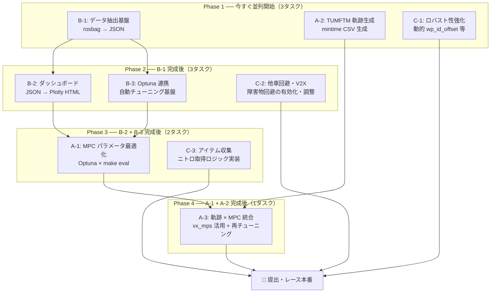
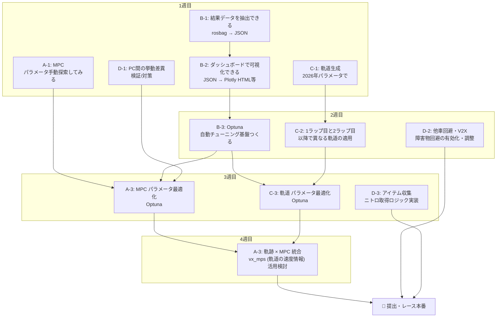

# 自動運転AIチャレンジ（レーシングカート SW部門）戦略文書

> 仕様ドキュメント（現仕様の正）。最終確認: 2026-06-21。文書運用方針は [docs/README.md](../README.md) を参照。

## 目次

1. [競技の理解](#1-競技の理解)
   - 1.1 競技形式
   - 1.2 スコアリングと勝敗条件
   - 1.3 提出の制約
   - 1.4 ペナルティルール
2. [現状の把握](#2-現状の把握)
   - 2.1 実装済み機能の全体像
   - 2.2 MPC の仕組み（LTV-MPC + OSQP）
   - 2.3 参照経路（最小曲率ライン）
   - 2.4 障害物回避・V2X追跡（実装済み・無効）
   - 2.5 ブースト加速（実装済み・無効）
   - 2.6 現在のラップタイム実績とボトルネック
3. [速度・ラップタイム改善](#3-速度ラップタイム改善)
   - 3.1 MPCパラメータチューニング
   - 3.2 レーシングライン最適化（TUMFTM mintime）
   - 3.3 速度プロファイルの活用（vx_mps を MPC に渡す）
   - 3.4 セクション別速度設定（ref_vel.yaml）
   - 3.5 Lap1 vs Lap2 以降の戦略
4. [レース戦略](#4-レース戦略)
   - 4.1 他車との衝突回避（V2X + 障害物回避有効化）
   - 4.2 ブーストアイテムの収集と活用
   - 4.3 追い越し・逃げ切りの判断
   - 4.4 予選と決勝での戦略の違い
5. [評価フレームワーク](#5-評価フレームワーク)
   - 5.1 評価指標の定義
   - 5.2 評価ダッシュボードの設計
   - 5.3 ローカル評価環境（make eval）の位置づけ
   - 5.4 提出先 rosbag とローカルの差異
6. [最適化ループ](#6-最適化ループ)
   - 6.1 パラメータ最適化の方針
   - 6.2 Optuna による自動チューニング
   - 6.3 提出サーバーを使ったループ設計
   - 6.4 半自動化パイプライン
7. [ロバスト性・信頼性](#7-ロバスト性信頼性)
   - 7.1 waypoint探索のロバスト性（ループジャンプ対策）
   - 7.2 ハードウェア差への対応（動的 wp_id_offset）
   - 7.3 計算時間の監視とフォールバック
   - 7.4 make eval での最終検証フロー
8. [実装ロードマップ](#8-実装ロードマップ)
   - 8.1 即できること（設定変更のみ）
   - 8.2 短期（〜1週間）
   - 8.3 中期（〜1ヶ月・提出開始まで）
   - 8.4 提出開始後のループ運用

---

## 1. 競技の理解

### 1.1 競技形式

本競技はシミュレータ（AWSIM）上のCCTBコースを舞台とした自動運転レースである。

| 項目 | 予選（SIM） | 決勝（SIM） |
|------|------------|------------|
| 参加台数 | 3台（チャレンジャー + ランク近接チーム1台 + 運営NPC1台） | 4台（チャレンジャー + 他チーム3台、NPCなし） |
| 環境 | AWSIM シミュレータ / CCTBコース | 同左 |
| 周回数 | 6周 | 6周 |
| タイムリミット | 10分 | 10分 |

- **予選**はランキング近接チームおよび運営NPCとの3台レースで実施される
- **決勝**はNPCが存在せず、純粋に他チーム3台との実力勝負となる
- タイムアタック形式ではなく、**完走順位**が結果を決定する

### 1.2 スコアリングと勝敗条件

勝敗はランキングポイントの増減で管理される。

```
自チームが提出
  → 対戦相手として選ばれた別チームのレースに自動的にエントリー
  → レース実施
  → 1位完走（勝利）→ ランク上昇
  → 敗北 or NPC勝利 → ランク下降 or 維持
```

**重要な特性:**

- 「勝利」の定義は**1位完走**であり、タイムではなく順位が全て
- 自分がNPCに負けた場合もランク下降の対象となる（予選）
- 決勝ではNPCが存在しないため、他チーム3台全てに先行する必要がある
- 提出後、相手チームのレースに登録されるため、提出頻度が試合数に直結する

### 1.3 提出の制約

#### 提出対象ディレクトリ

```
aichallenge/workspace/src/aichallenge_submit/
```

このディレクトリ配下のパッケージのみが提出・変更可能。主な含有物：

| パッケージ / ファイル | 用途 |
|----------------------|------|
| `multi_purpose_mpc_ros/` | MPC制御本体 |
| `multi_purpose_mpc_ros/config/config.yaml` | 制御パラメータ設定 |
| `multi_purpose_mpc_ros/env/*/traj_*.csv` | 参照軌跡CSV |
| `aichallenge_submit_launch/launch/` | launchファイル群 |
| `simple_pure_pursuit/` | Pure Pursuit制御 |
| `tiny_lidar_net_controller/` | E2Eニューラルネット制御 |

**変更不可:** `aichallenge_system/`（AWSIM設定、センサー定義等）

#### 提出手順

```bash
./create_submit_file.bash    # → tar.gz 生成
# → 大会Webサイトにアップロード
```

#### 提出制約

- **1日あたり約20回**の提出上限
- 提出サイトは**大会開始1ヶ月後にオープン**
- 提出後は**結果rosbagをダウンロード**可能（デバッグに活用）

### 1.4 ペナルティルール

| 違反行為 | ペナルティ |
|----------|-----------|
| 壁への衝突 | 一定時間の速度制限（具体的数値は未定） |
| 他車への衝突 | 同上 |
| 意図的な危険走行 | 禁止（失格リスク） |
| シミュレーション環境へのハッキング | 禁止 |

**衝突ペナルティは「完走順位」に直結するため最重要課題。**
速度制限ペナルティが発動すると順位が大幅に下落するリスクがある。完走・無衝突を最優先とする戦略が基本方針となる。

---

## 2. 現状の把握

### 2.1 実装済み機能の全体像

提出可能パッケージの実装状態と有効/無効の現状：

| パッケージ | 機能 | 実装状態 | デフォルト |
|-----------|------|----------|-----------|
| `multi_purpose_mpc_ros` | MPC制御（40Hz、LTV-MPC + OSQP） | 完成 | **有効** |
| `simple_pure_pursuit` | Pure Pursuit制御 | 完成 | 無効 |
| `tiny_lidar_net_controller` | E2Eニューラルネット制御 | 完成 | 無効 |
| `boost_commander.cpp` | ブースト加速制御（C++） | 完成 | 無効 |
| `path_constraints_provider` | 経路制約プロバイダ | 完成 | 無効 |
| `v2x_vehicle_tracker.py` | V2X他車追跡 | 完成 | 有効（未活用） |
| `gyro_odometer`, `imu_corrector`, `imu_gnss_poser` | 自己位置推定 | 完成 | 有効 |

**未実装:**
- アイテム収集（ニトロ拾い上げ）
- 積極的追い越し戦略
- 衝突後自動リカバリ

### 2.2 MPC の仕組み（LTV-MPC + OSQP）

#### アーキテクチャ概要

```
センサ入力（GNSS, IMU, オドメトリ）
  → 自己位置推定
  → 参照軌跡CSVから最近傍ウェイポイントを検索
  → LTV-MPC（線形時変二次計画問題）をOSQPで解く
  → 速度・ステア角指令をAWSIMへ送信（40Hz）
```

#### モデル定義

| 要素 | 内容 |
|------|------|
| モデル種別 | 線形時変（LTV）運動学的自転車モデル |
| 状態ベクトル | `[e_y（横偏差）, e_ψ（ヨー角誤差）, t（時刻）]` |
| 入力ベクトル | `[v（速度）, δ（ステア角）]` |
| ソルバー | OSQP（二次計画法） |
| 制御周期 | 40 Hz（25 ms） |
| 予測ホライゾン | N = 20 ステップ（0.5 秒先） |

#### コスト関数（現在の中速設定）

```yaml
# config.yaml より
Q:  [3000000.0, 90000000.0, 100000.0]  # [e_y, e_psi, t]
R:  [100000.0, 0.0]                    # [v, delta]
QN: [1000000.0, 1000.0, 10000.0]       # 終端コスト
```

- `Q[1]`（ヨー角誤差）= 90,000,000 → ヨー角精度を最優先
- `Q[2]`（時刻コスト）= 100,000 → **速さへのインセンティブが弱い（要改善）**
- `Q[0]`（横偏差）= 3,000,000 → 低速時のイン攻め抑制のため意図的に高め設定

#### 制約条件

```yaml
v_max:           20.0 km/h   # 速度上限（現在の中速設定）
ay_max:          6.5 m/s²    # 最大横加速度（コーナー速度制限）
delta_max_deg:   32.0 °      # ステア角上限
steer_rate_max:  0.35 rad/s  # ステアレート上限
a_min:          -1.6 m/s²   # 最大減速度
a_max:           0.7 m/s²   # 最大加速度
```

#### 参照軌跡CSVの読み込み列

```
s_m, x_m, y_m, psi_rad, kappa_radpm, vx_mps, ax_mps2
                                      ↑           ↑
                               （無視）      （無視）
```

**訂正（コード確認済み）:** 実際にMPCが使用する列は `x_m, y_m` の2列のみ。`mpc_controller.py:332` の `wp_x, wp_y, _, _ = load_ref_path(...)` で `psi_rad` / `kappa_radpm` は破棄されており、`ReferencePath` 内部で waypoint 間隔から再計算される。`vx_mps` / `ax_mps2` も無視され、速度プロファイルはMPC側の `v_max` / `ay_max` パラメータで決定される。

→ 結論: **CSVの形状（x, y の並び）だけが effective であり、psi/kappa/速度列の値は無害**。ただし waypoint 間隔の均一さ・滑らかさは再計算される kappa の質に直結するため重要（`osm-to-raceline` DESIGN.md §1.3 参照）。

### 2.3 参照経路（最小曲率ライン）

#### 現在使用中の経路

```
env/final_ver3/traj_mincurv.csv
```

| 属性 | 値 |
|------|----|
| 最適化手法 | 最小曲率最適化（TUMFTM global_racetrajectory_optimization） |
| ウェイポイント数 | 350点 |
| 平均間隔 | 約0.6 m |
| 占有格子地図 | `env/final_ver3/occupancy_grid_map.yaml`（0.1 m/セル解像度） |

**要確認（2026-07-05時点）:** `env/` には `final_ver4` まで存在するが、`config.yaml` は依然として `final_ver3` を指している。4バージョンを比較したところ、地図（occupancy grid map）自体は `final`/`final_ver2` と `final_ver3`/`final_ver4` の2世代のみで、コース形状は共通。走行ラインの最小旋回半径は `final`(3.49m) → `final_ver2`(3.00m) → `final_ver3`(2.57m) → `final_ver4`(2.25m) と、バージョンを重ねるごとにヘアピンを攻めたタイトなラインへ再最適化されている。`final_ver4` に更新するか、`final_ver3` を意図的に使い続けているのか要確認。

#### 利用可能な他の経路

```
env/preliminary/optimized_traj_mintime.csv    # 予選コース用 最速ライン
env/preliminary/optimized_traj_shortest.csv   # 予選コース用 最短距離ライン
```

> **注意:** `preliminary/` は予選コース用であり、決勝コース（final_ver3）では使用不可。

#### 経路差し替え方法

`config.yaml` の1行変更のみ。他の設定変更は不要。

```yaml
reference_path:
  csv_path: "env/final_ver3/traj_mincurv.csv"  # ← ここを変更するだけ
```

### 2.4 障害物回避・V2X追跡（実装済み・無効）

#### V2X 他車追跡の動作

```
/v2x/vehicle_positions（他車位置・速度）
        ↓
v2x_vehicle_tracker（等速直線モデルで将来位置を予測）
        ↓
予測位置を円形障害物に変換
        ↓
path_constraints_provider（経路幅を動的に狭める）
        ↓
MPC（経路幅制約として自動的に回避行動を生成）
```

**有効化:** launch引数に `use_obstacle_avoidance:=true` を追加するだけ。

#### `/aichallenge/objects` トピック

- **型:** `Float64MultiArray`
- **発行元:** AWSIM
- **フォーマット:** `[x, y, z, radius, x, y, z, radius, ...]`
- ニトロアイテム・修理アイテムの位置情報を含む可能性あり
- 現状は「回避すべき障害物」として処理されているが、**アイテム収集への転用が可能**

### 2.5 ブースト加速（実装済み・無効）

| 属性 | 値 |
|------|----|
| 有効化パラメータ | `use_boost_acceleration: true` |
| 通常制御周期 | 50 Hz |
| ブースト時制御周期 | 1,700 Hz |
| ブースト時速度上限 | 40 km/h |
| ブースト時加速度 | 400 m/s²（ハードコード） |

**現状の課題:**
- アイテムボックス取得イベントとの連動ロジックが未実装
- いつブーストを発動するかのトリガー条件が定義されていない

### 2.6 現在のラップタイム実績とボトルネック

#### ラップタイム実績（config.yaml コメントより）

| 設定名 | v_max | ay_max | Lap1 | Lap2 |
|--------|-------|--------|------|------|
| 究極 | 30 km/h | 12.0 m/s² | 53 s | 47 s |
| 高速（gnss delay 0.3s） | 30 km/h | 9.5 m/s² | 55 s | 49 s |
| 中高速 | 25 km/h | 7.0 m/s² | 59 s | 54 s |
| **中速（現在）** | **20 km/h** | **6.5 m/s²** | **67 s** | **64 s** |
| 低速 | 15 km/h | 5.5 m/s² | 86 s | — |

「究極」設定と「現在」設定では **1周あたり約17〜20秒の差**がある。6周レースでは最大**2分以上の差**が生じうる。

#### 主要ボトルネック

1. **`v_max = 20 km/h` の過度な保守性** → 直線でも速度上限に張り付いている
2. **`Q[2] = 100,000`（時間コスト）の低さ** → MPCが速度最大化を重視しない
3. **コーナーセクションs4（wp155）、s6（wp265）が 22 km/h に制限** → `ay_max` 引き上げで改善可能

---

## 3. 速度・ラップタイム改善

### 3.1 MPCパラメータチューニング

#### パラメータの意味と調整方針

| パラメータ | 現在値 | 役割 | 調整の考え方 |
|---|---|---|---|
| `Q[0]`（e_y 重み） | 3,000,000 | 横偏差コスト | 高いほど中央線に厳密。下げるとコーナーでインを攻める |
| `Q[1]`（e_ψ 重み） | 90,000,000 | 方向偏差コスト | 現在最大値。方向精度を保つ基盤として維持 |
| `Q[2]`（t 重み） | 100,000 | 速く走るインセンティブ | **現在低すぎる。**高いほど速度最大化を選好 |
| `v_max` | 20 km/h | 直線での最高速度上限 | コース全体の速度上限 |
| `ay_max` | 6.5 m/s² | 最大横加速度 | コーナー速度の上限を `v = √(ay_max / κ)` で決定 |
| `wp_id_offset` | 2 | 制御遅延補償（先読みステップ数） | 高速化で遅延影響が増えるため速度に応じて大きくする |

`ros2 param set` でリアルタイム変更可能（走行中にシミュレーションで動作確認できる）:

```bash
ros2 param set /mpc_controller v_max 25.0
ros2 param set /mpc_controller ay_max 7.5
ros2 param set /mpc_controller wp_id_offset 3
```

#### フェーズ別チューニング計画

| フェーズ | v_max | ay_max | Q[2] | wp_id_offset | 期待Lap2 | リスク |
|---|---|---|---|---|---|---|
| **現在** | 20 km/h | 6.5 m/s² | 100k | 2 | 64s | — |
| **フェーズ1** | 25 km/h | 7.5 m/s² | 500k | 2 | 58〜59s | 低 |
| **フェーズ2** | 28 km/h | 9.5 m/s² | 1M | 3 | 〜52s | 中 |
| **フェーズ3** | 30 km/h | 12.0 m/s² | 2M | 3〜4 | 〜47s | 高 |

**フェーズ1** の具体的な config.yaml:

```yaml
v_max: 25.0
ay_max: 7.5
Q: [2000000.0, 90000000.0, 500000.0]
```

### 3.2 レーシングライン最適化（TUMFTM mintime）

**更新（2026-07-05）:** 以下の手順を手動で行うツールとして `~/osm-to-raceline`（`kokko1210206/osm-to-raceline`、aichallenge-racingkartと同じ親ディレクトリに配置）がすでに存在し、GUI操作で完結する。Lanelet2地図（`wide_lanelet2_map.osm`）からTUMフォーク（casadi3.6/py3.10対応）を実行し、`traj_mintime.csv` を生成する。**MPC側が読み込み後に (x, y) をノード内の粗い解像度で再構成した際に経路として破綻しないかの安全検査結果表示も付属**しており、本節の手順を再現する場合はまずこのツールを使う。詳細は `~/osm-to-raceline/README.md` および `DESIGN.md`。

#### mincurv と mintime の比較

| 比較項目 | mincurv（現在） | mintime |
|---|---|---|
| 最適化目標 | 曲率の最小化 | タイムの最小化 |
| 計算時間 | 数秒 | 1〜30分（CasADi + IPOPT） |
| 安定性 | 高い | 車両パラメータの精度に依存 |
| 速さ | 中程度（近似解） | 理論的に最速 |

#### mintime 軌跡生成の手順

1. **コース境界線 CSV の準備**（`x_m, y_m, w_tr_right_m, w_tr_left_m`）
   - 占有格子地図から逆算、または Lanelet2 地図から変換

2. **GGV 図の作成**（公開パラメータから作成可能）

   | パラメータ | 値 |
   |---|---|
   | 質量 | 160 kg |
   | ホイールベース | 1.087 m |
   | ax_max（加速） | +3.2 m/s² |
   | ax_min（制動） | −3.2 m/s² |
   | ay_max（旋回） | 9.5 m/s²（チューニング次第） |
   | v_max | 30 km/h（8.33 m/s） |
   | エアロドラッグ | 0（シミュレータ環境） |

3. **TUMFTM 実行**

   ```bash
   python main_globaltraj.py
   # → 出力: traj_race_cl.csv（7列: s_m, x_m, y_m, psi_rad, kappa_radpm, vx_mps, ax_mps2）
   ```

4. **CSVを配置して config.yaml の csv_path を変更するだけで適用**

   ```yaml
   reference_path:
     csv_path: "env/final_ver5/traj_mintime.csv"
   ```

### 3.3 速度プロファイルの活用（vx_mps を MPC に渡す）

現在、TUMFTM が出力する `vx_mps`（最適速度）は無視されている。`utils.py` の `load_ref_path()` を修正して活用する:

```python
# vx_mps を上限速度として採用
v_ref = min(v_max_config, vx_mps_from_csv)
```

**効果:** TUMFTMの動力学最適化（加速・制動・旋回を同時考慮）の結果が速度プロファイルに反映される。
**条件:** TUMFTM 実行時の車両パラメータをレーシングカートの公開値に合わせること。

### 3.4 セクション別速度設定（ref_vel.yaml）

```yaml
# 現在 → 引き上げ余地あり
s4: {ref_vel: 22.0, wp_id: 155}  # → 24〜25 km/h
s6: {ref_vel: 22.0, wp_id: 265}  # → 24〜25 km/h
```

`reference_velocity_configulator.py` で ROS param としてリアルタイム変更可能。

### 3.5 Lap1 vs Lap2 以降の戦略

#### ROI の観点

| 改善対象 | 効果 | 影響するラップ |
|---|---|---|
| Lap1 を 67s → 64s に改善 | +3秒 | 1周のみ |
| Lap2〜6 を 64s → 58s に改善 | **+30秒** | 5周分 |

**Lap2 以降の改善を優先。**

#### Lap1 向けの調整（Lap2 安定後に着手）

軌跡の形は変えなくてよい（MPCが速度を自動調整）。`/awsim/status` のラップ数でパラメータを切り替える:

```bash
# Lap1 のみ：速度インセンティブを強化、先読みを小さく
ros2 param set /mpc_controller Q2 1000000
ros2 param set /mpc_controller wp_id_offset 1
# Lap2 以降：通常設定に戻す
ros2 param set /mpc_controller Q2 500000
ros2 param set /mpc_controller wp_id_offset 2
```

---

## 4. レース戦略

### 4.1 他車との衝突回避（V2X + 障害物回避有効化）

#### 競技形式における位置づけ

本競技は**完走順位で勝敗が決まるレース**。衝突ペナルティ（速度制限）は順位を落とす直接的な原因となる。**「衝突しないこと」は「速く走ること」と同等かそれ以上に重要。**

#### 有効化

```bash
use_obstacle_avoidance:=true  # launch引数に追加するだけ
```

#### 仕組み

```
/v2x/vehicle_positions（他車位置）
  → v2x_vehicle_tracker（等速直線で将来位置予測）
  → 円形障害物に変換
  → path_constraints_provider（経路幅を動的に狭める）
  → MPC が自動回避（制御変更不要）
```

- **コリドーフィルタ:** 参照パス周辺のみの障害物を採用（コース外の誤検知を防止）

### 4.2 ブーストアイテムの収集と活用

`/aichallenge/objects`（AWSIM発行）からアイテム位置を取得:

```
フォーマット: [x, y, z, radius, x, y, z, radius, ...]
```

**実装が必要なもの:**

| ステップ | 内容 | 難易度 |
|---|---|---|
| 1 | `/aichallenge/objects` を購読してアイテム位置を検出 | 低 |
| 2 | アイテムが参照パスのどのウェイポイント付近かを特定 | 低〜中 |
| 3 | アイテム通過ウェイポイント付近で経路を微修正 | 中 |
| 4 | 取得後に `use_boost_acceleration=true` を発動 | 中 |

**優先度:** MPC チューニング安定後に着手。

### 4.3 追い越し・逃げ切りの判断

#### 現状

- V2X 障害物回避は「前車を円形障害物として回避」するだけ
- コース幅に余裕がある区間では偶発的に内側から追い越す場合あり
- 能動的な「追い越し判断」ロジックは未実装

#### 改善の方向性

```
条件1: 前車との距離 < 閾値（例: 5m）
条件2: 自車速度 > 前車速度
  → 追い越しモードへ移行
  → path_constraints_provider の制約を追い越し側に非対称化
  → 前車を抜いたら通常モードへ復帰
```

**難易度:** 高 / **優先度:** 中（衝突回避が安定してから）

### 4.4 予選と決勝での戦略の違い

| 項目 | 予選 | 決勝 |
|---|---|---|
| 台数 | 3台（自分 + 他チーム1台 + NPC） | 4台（自分 + 他チーム3台） |
| NPC | あり（挙動が予測しやすい） | なし |
| 衝突リスク | 中程度 | 高い（全員が人間チーム） |
| 重視すること | NPC より確実に速く安定走行 | 他チームより速く + 衝突ゼロ |

#### 設定の使い分け

| 局面 | 推奨フェーズ | 障害物回避 |
|---|---|---|
| 予選（全体） | フェーズ1〜2 | 有効 |
| 決勝・序盤（集団） | フェーズ1〜2 | 有効 |
| 決勝・単独走行 | フェーズ2〜3 | 有効 |
| 決勝・首位逃げ切り | フェーズ3 | 有効 |

---

## 5. 評価フレームワーク

### 5.1 評価指標の定義

**Lap1 と Lap2 以降を必ず分けて扱う**（Lap1はv=0スタートのため構造的に遅い）。最適化の主目的は `avg_lap_2to6` の最小化に置く。

#### ラップタイム系（最重要）

| 指標名 | 説明 |
|--------|------|
| `lap1_time` | Lap1 のタイム（参考値・別扱い） |
| `best_lap` | Lap2 以降のベストラップ |
| `avg_lap_2to6` | **最適化の主目的。**Lap2〜6 の平均タイム |
| `std_lap_2to6` | 安定性の指標。小さいほど安定 |

#### 経路追従誤差

| 指標名 | 説明 |
|--------|------|
| `max_ey_m` | 最大横偏差（コーナーで膨らんだ最大値）|
| `rms_ey_m` | RMS 横偏差（全体的な追従精度）|

計算方法: `/localization/kinematic_state` の位置 × `traj_mincurv.csv` の最近傍点との距離。

#### 速度プロファイル

| 指標名 | 説明 |
|--------|------|
| `max_speed_kmh` | 達成最高速 |
| `avg_speed_kmh` | 平均速度 |
| `v_max_reach_rate` | 設定 v_max に対して何 % 達したか |

`v_max_reach_rate` が低い（70% 以下）場合、コーナー制約や保守的な制御が原因。

#### 制御品質

| 指標名 | 説明 | 目安 |
|--------|------|------|
| `avg_solve_ms` | OSQP 平均求解時間 | ローカル ~15ms、サーバー ~3ms |
| `max_solve_ms` | OSQP 最大求解時間 | 25ms（制御周期）以内が理想 |
| `mpc_infeasible_count` | 安全マージン緩和回数 | 0 が理想 |

#### 安全性

| 指標名 | 説明 |
|--------|------|
| `collisions` | 衝突回数（`autoware.log` からカウント）|

衝突が1回でもある場合、Optuna では無効試行（TrialPruned）として除外する。

### 5.2 評価ダッシュボードの設計

#### JSONデータ構造（中核）

```json
{
  "run_id": "20260528-123456",
  "timestamp": "2026-05-28T12:34:56",
  "params": {
    "v_max": 25.0,
    "ay_max": 7.5,
    "Q": [3000000, 90000000, 500000],
    "QN": [1000000, 1000, 10000],
    "R": [100000, 0.0],
    "N": 20,
    "wp_id_offset": 2,
    "trajectory": "env/final_ver3/traj_mincurv.csv"
  },
  "metrics": {
    "lap1_time": 67.2,
    "best_lap": 52.3,
    "avg_lap_2to6": 52.82,
    "std_lap_2to6": 0.28,
    "collisions": 0,
    "mpc_infeasible_count": 3,
    "avg_solve_ms": 8.3,
    "max_speed_kmh": 24.8,
    "avg_speed_kmh": 21.3,
    "max_ey_m": 0.45,
    "rms_ey_m": 0.12
  },
  "profiles": {
    "speed_by_distance": [[0.0, 0.0], [1.0, 5.2]],
    "ey_by_distance": [[0.0, 0.0], [1.0, 0.02]],
    "trajectory_xy": [[89656.8, 43128.9]]
  },
  "summary_text": "v_max=25.0 で avg_lap=52.82s を達成。最大横偏差 0.45m（コーナーs4付近）。衝突なし。infeasible 3回。"
}
```

**各層の役割:**
- `params`: 再現性の確保（後から同一条件を再現できる）
- `metrics`: スカラー値のみ → Optuna が直接読む
- `profiles`: 時系列データ → グラフ描画用
- `summary_text`: LLM がそのまま読める自然言語サマリー

#### 可視化: Plotly（単一 HTML）

採用理由: `motion_analytics.html` で既に使用中、依存ゼロ、インタラクティブ、比較機能が容易。

```
┌──────────────────────────┬──────────────────────────┐
│ ラップタイム棒グラフ      │ パラメータサマリー表      │
│ (Lap1 を灰色で別色)       │ + solve_time ヒストグラム │
├──────────────────────────┼──────────────────────────┤
│ 速度プロファイル          │ 経路追従誤差 e_y          │
│ (複数ラップ重ね描き)      │ (コース距離 vs e_y)       │
├──────────────────────────┴──────────────────────────┤
│ 走行軌跡（速度カラーマップ）                          │
└─────────────────────────────────────────────────────┘
```

比較モード: 複数 JSON を読み込んで同一グラフに重ね描き。

### 5.3 ローカル評価環境（make eval）の位置づけ

| 項目 | make dev | make eval |
|------|------------|-------------|
| 用途 | 開発・デバッグ | **最終検証・提出前確認** |
| イメージ | 開発用（マウント） | 評価用（焼き込み済み） |
| 自動開始 | 手動 | 自動（sync） |
| 制限 | 無制限 | 6 ラップ・600 秒 |

**ルール: `make eval` で動いた設定のみ提出する。`make dev` の結果だけで提出しない。**

### 5.4 提出先 rosbag とローカルの差異

#### ハードウェア差の問題

| 環境 | OSQP 平均求解時間 | 影響 |
|------|-----------------|------|
| ローカル（ノート PC） | ~15 ms | wp_id_offset=2 が適切 |
| 提出サーバー | ~3 ms | 同じ offset=2 では過補償になる可能性 |

#### 提出先 rosbag の特別な価値

| 情報 | 活用 |
|------|------|
| サーバーでの実際の `avg_solve_ms` | wp_id_offset の正確な再設定 |
| 実際の衝突タイミング・場所 | 危険箇所の特定 |
| NPC の挙動パターン（V2X） | 対NPC戦略の立案 |
| 実環境での `e_y` プロファイル | ローカルとの差分把握 |

ローカルと提出先の両方の rosbag に対応したダッシュボードを作ることで、環境差を定量的に把握できる。

---

## 6. 最適化ループ

### 6.1 パラメータ最適化の方針

#### 原則1: 分解して解く

```
× 悪い例: v_max と traj_mincurv.csv を同時に変えてタイムが改善
           → 軌跡が効いたのか、v_max が効いたのか不明

○ 良い例:
  Step 1: 軌跡を固定（ベースライン）
  Step 2: v_max / ay_max / Q 行列を Optuna でチューニング
  Step 3: 軌跡を差し替え（mintime）
  Step 4: Step 2 を再実行して再チューニング
```

#### 原則2: 感度分析で変数を絞る

各パラメータを ±10〜20% 変化させて `avg_lap_2to6` への影響を測定する。
重要変数 TOP3〜5 に絞って Optuna を回す。

Optuna の `optuna.visualization.plot_param_importances(study)` で自動的にパラメータ重要度を可視化できる。

#### 原則3: 評価コストが高いならベイズ最適化

| 手法 | 試行数 | 所要時間（1試行10分）|
|------|--------|-------------------|
| グリッドサーチ（5変数×5点） | 3125 回 | 非現実的 |
| ランダムサーチ | 50〜100 回 | ~8〜17 時間 |
| **ベイズ最適化（Optuna TPE）** | **30〜50 回** | **~5〜8 時間** |

### 6.2 Optuna による自動チューニング

```python
import optuna

def objective(trial: optuna.Trial) -> float:
    params = {
        "v_max":        trial.suggest_float("v_max", 20.0, 30.0),
        "ay_max":       trial.suggest_float("ay_max", 6.5, 12.0),
        "Q2":           trial.suggest_float("Q2", 1e5, 2e6, log=True),
        "wp_id_offset": trial.suggest_int("wp_id_offset", 1, 4),
    }

    run_result = run_evaluation(params)
    metrics = run_result["metrics"]

    if metrics["collisions"] > 0:
        raise optuna.TrialPruned()  # 衝突ありは無効試行
    if metrics["mpc_infeasible_count"] > 10:
        raise optuna.TrialPruned()

    return metrics["avg_lap_2to6"]  # 最小化

study = optuna.create_study(
    study_name="mpc_tuning_v1",
    direction="minimize",
    storage="sqlite:///optuna_study.db",  # SQLite に永続化（再開可能）
    load_if_exists=True,
    sampler=optuna.samplers.TPESampler(seed=42),
)
study.optimize(objective, n_trials=50)
```

**SQLite 永続化:** `load_if_exists=True` により途中で止めても再開可能。複数日にわたって少しずつ試行を積み重ねられる。

### 6.3 提出サーバーを使ったループ設計

#### 1 日のサイクル（提出 約20回 を最大活用）

```
朝 9時:  前日の rosbag をダウンロード
         → analyze_rosbag.py で自動解析 → JSON 生成
         → Optuna に結果を登録 → 次の 5 パラメータ候補を生成
         → 5 回提出

昼12時:  午前の rosbag (5本) をダウンロード → 一括解析
         → Optuna 登録 → 次の 5 候補生成 → 5 回提出

夕17時:  昼の rosbag (5本) をダウンロード → 再解析
         → 残り 10 回提出（最有力候補 5点 + 探索的 5点）

夜:      全結果をダッシュボードで確認
         → parameter importance を確認
         → 翌日の方針決定
```

#### 1 回の提出から得られる情報の最大化

MPC コントローラ内にログを仕込んで autoware.log に記録:

```python
self.get_logger().info(f"SOLVE_TIME_MS:{solve_ms:.2f}")
self.get_logger().info(f"WP_ID_OFFSET:{self.wp_id_offset}")
self.get_logger().info(f"EY_MAX:{self.max_ey:.4f}")
self.get_logger().info(f"INFEASIBLE_COUNT:{self.infeasible_count}")
```

### 6.4 半自動化パイプライン

#### 必要なスクリプト群

| スクリプト | 役割 | 優先度 |
|----------|------|--------|
| `analyze_rosbag.py` | rosbag + autoware.log → JSON メトリクス変換 | **最優先** |
| `generate_dashboard.py` | JSON（複数可）→ Plotly 単一 HTML 生成 | **最優先** |
| `generate_config.py` | Optuna の次候補 → config.yaml 生成 | 高 |
| `update_optuna.py` | サーバー結果を Optuna trial に手動登録 | 高 |
| `build_submit.sh` | ビルド → tar.gz 生成 | 中 |

#### データフロー

```
output/{timestamp}/
├── result-details.json  ─┐
├── autoware.log          ├─→ analyze_rosbag.py ─→ run_{id}.json
└── rosbag2_autoware.mcap ─┘                              │
                                                          ├─→ update_optuna.py → optuna_study.db
                                                          │                            │
                                                          └─→ generate_dashboard.py   └─→ generate_config.py
                                                                   │                             │
                                                              dashboard.html             config.yaml ×N
                                                                                                 │
                                                                                        build_submit.sh
                                                                                                 │
                                                                                       submit.tar.gz
```

#### 段階的な自動化ロードマップ

```
Phase 1（1〜2日目）: analyze_rosbag.py + generate_dashboard.py のみ実装
Phase 2（3〜4日目）: update_optuna.py + generate_config.py を追加
Phase 3（5日目以降）: build_submit.sh を追加 → 「提出ボタンを押すだけ」の状態
Phase 4（余裕があれば）: Playwright による自動提出（完全自動化）
```

---

## 7. ロバスト性・信頼性

### 7.1 waypoint探索のロバスト性（ループジャンプ対策）

**新規発見（2026-07-05）。未実装。**

#### 問題の本質

`spatial_bicycle_models.py:293-307` の `get_closest_waypoint(x, y)` は、コース全waypoint（約350点）に対する**グローバル最近傍探索**（`np.argmin(distances)`）。`update_states()`（毎制御ステップ、40Hz）から呼ばれる。

コースが `circular: true` の閉ループであり、かつヘアピンのように**弧長では遠いが空間的には近い**区間が存在する場合、車両が大きく乖離した瞬間にこの探索が「本来追従すべき区間」ではなく「たまたま空間的に近い別区間」の waypoint を誤って選び、`wp_id`/`s` が不連続にジャンプしうる。

#### 現在のコースでの実害確認

`final_ver3`（現行）のトラジェクトリを幾何解析した結果、以下の近接区間が実在する:

| 区間 | 弧長差 | 空間距離 |
|---|---|---|
| s=89 付近 ⇔ s=151 付近（ヘアピン内側） | 62m | **8.5m** |
| s=125 付近 ⇔ s=337 付近 | 137m | 9.5m |

`final_ver4` は最小旋回半径がさらに小さく（2.25m）、同種の近接区間の空間距離も同程度（9.1m）。バージョンを重ねるごとにタイトなラインへ最適化されており、リスクは軽減されていない。

`max_width: 6.0` / 車体幅+安全マージン(2.30m) を踏まえると、8.5〜9.5mは「コーナーで大きく膨らめば届く」距離感。

**実測rosbag（直近6回のtrial、N=20・v_max=20km/h）ではこのジャンプは1件も観測されていない**（`s` の推移を確認、ラップ境界(≈349m)以外に不自然な不連続なし）。ただし現在は中速プリセットで大きな乖離が起きにくいため「起きていない」のではなく「まだ顕在化する条件に達していない」と解釈すべき。§3.1のフェーズ2・3（速度・`ay_max`引き上げ）を進めるほど、乖離量が増えてこのリスクが顕在化する可能性が高い。

#### 対策案（未実装）

前回の `wp_id` 近傍のみを探索し、大きく乖離した場合（初回起動時・衝突リカバリ後など）のみ全探索にフォールバックする。

```python
def get_closest_waypoint(self, x, y, search_window=30, fallback_threshold=5.0):
    # 1. self.wp_id を中心に ±search_window（circular考慮）だけ探索
    # 2. 最小距離が fallback_threshold 未満ならそれを採用
    # 3. 超えていたら（トラック復帰直後などロスト状態）全waypoint探索にフォールバック
    ...
```

**優先度: 高。** 速度を上げる（§3.1フェーズ1以降）前の予防的修正として、他のロバスト性強化（§7.2/7.3）より先に着手する価値がある。実装コストは低い一方、`update_reference_path()`（経路切り替え時の初回探索）は従来通り全探索のままでよい点に注意（ここは有効な `wp_id` の前提がないため）。

### 7.2 ハードウェア差への対応（動的 wp_id_offset）

**実装状況（2026-07-05確認）: 未実装。** `mpc_controller.py` には固定値 `wp_id_offset`（`ros2 param set` での手動変更のみ）しかなく、以下の解決策1〜3はいずれもコード上に存在しない。

#### 問題の本質

`wp_id_offset` の最適値は OSQP 求解時間（CPU スペック依存）によって変わる。

| 環境 | OSQP 求解時間 | 最適 wp_id_offset |
|------|-------------|-----------------|
| ローカル（ノート PC） | ~15ms | 2〜3 |
| 提出サーバー（高スペック） | ~3ms | 1 |

昨年の問題（ローカルで動いたパラメータが提出先で動かなかった）の主因はここにある。

#### 解決策 1: 起動時ベンチマーク（推奨・実装コスト低）

```python
def _benchmark_and_set_offset(self):
    """起動直後にOSQP求解時間を計測してoffsetを自動設定"""
    times = []
    for _ in range(10):
        t0 = time.perf_counter()
        self.mpc.get_control()
        times.append(time.perf_counter() - t0)

    avg_solve_ms = np.mean(times) * 1000
    Ts = 1.0 / self.control_rate  # 0.025s
    self.wp_id_offset = max(1, round(avg_solve_ms / 1000 / Ts))
    self.get_logger().info(
        f"Benchmark: {avg_solve_ms:.1f}ms → wp_id_offset={self.wp_id_offset}")
```

#### 解決策 2: タイムスタンプベース補償（根本的解決）

```python
# センサーデータの取得時刻から実際の遅延をリアルタイム計算
sensor_timestamp = msg.header.stamp
now = self.get_clock().now()
actual_delay = (now - sensor_timestamp).nanoseconds * 1e-9
wp_id_offset = int(actual_delay / Ts)  # CPUスペック依存なし
```

#### 解決策 3: ローパスフィルタで急変を吸収

```yaml
accel_low_pass_gain: 0.5  # デフォルト 1.0（フィルタなし）から引き下げ
steer_low_pass_gain: 0.7
```

### 7.3 計算時間の監視とフォールバック

**実装状況（2026-07-05確認）: `use_stats` によるログ収集（`/mpc/stats` rosbag記録）のみ実装済み。OSQP `time_limit` 設定、infeasible連続時の `v_max` 自動引き下げは未実装。**

#### 実測データ（2026-07-05、N=20・v_max=20km/h・直近6回のtrial）

| 実行 | p99 solve time | 25ms(制御周期)超過回数 | 母数 |
|---|---|---|---|
| 06/26 | 18.8ms | 17回 | 16162 |
| 06/27 (1) | 23.8ms | 125回 | 18443 |
| 06/27 (2) | 17.5ms | 1回 | 18722 |
| 06/28 (1) | 14.0ms | 0回 | 15661 |
| 06/28 (2) | 16.8ms | 8回 | 15644 |
| 07/04 | 14.9ms | 5回 | 15653 |

現在の `N=20` でも既に制御周期（25ms）を超過する瞬間が発生している（最大solve timeは全実行で27〜52ms）。トラブル1対策として `N` を増やす場合、この超過頻度がさらに悪化する可能性が高く、**Nを上げる前に段階的な計測（ベンチマーク）で許容上限を確認すべき**。OSQP `time_limit` 設定（本節の解決策）はこの問題を緩和する候補だが未実装。

#### `use_stats` によるログ収集（config.yaml で有効化）

```python
if self.use_stats:
    self.get_logger().info(f"SOLVE_TIME_MS:{solve_ms:.2f}")
    self.get_logger().info(f"INFEASIBLE_COUNT:{self.infeasible_count}")
```

#### OSQP タイムアウトを制御周期に対する比率で設定

```python
time_limit = 0.8 * (1.0 / self.control_rate)  # 制御周期の80%
solver.update_settings(time_limit=time_limit)
```

#### MPC infeasible 時のフォールバック

```
infeasible 1回    → 安全マージン緩和（現行の5段階）
infeasible 連続3回 → v_max を 10% 下げて再計算
infeasible 連続5回 → v_max を 20% 下げて緊急減速
```

### 7.4 make eval での最終検証フロー

#### 提出前チェックリスト

```
□ make autoware-build でビルド成功
□ make eval で 6周完走（衝突・コース逸脱なし）
□ result-details.json でラップタイムが期待値以内
□ autoware.log で衝突回数が 0
□ motion_analytics.html で速度プロファイルが期待通り
□ avg_solve_ms がタイムアウト設定の 50% 以下
□ ./create_submit_file.bash で tar.gz 生成・内容確認
```

#### solve_time による環境差の追跡

`make eval` での `avg_solve_ms` とサーバーの `avg_solve_ms` を比較することで、環境差を定量把握できる。この差分が大きい場合は次の提出で `wp_id_offset` を調整する。

---

## 8. 実装ロードマップ

### 8.1 即できること（設定変更のみ）

コード変更不要・数時間以内で試せる改善。**1変更=1評価の原則**で進める。

| タスク | 変更内容 | 期待効果 |
|-------|---------|---------|
| フェーズ1パラメータ適用 | `v_max=25, ay_max=7.5, Q[2]=500k` | Lap2 64s → 58s |
| ブースト有効化 | `use_boost_acceleration:=true` | 応答性向上 |
| 障害物回避有効化 | `use_obstacle_avoidance:=true` | 衝突ペナルティ防止 |
| コーナー速度引き上げ | ref_vel.yaml の s4, s6 を 22 → 24 km/h | 1〜2s/lap |

### 8.2 短期（〜1週間）

**評価ループの確立は完了済み。**（2026-07-05更新）`racingkart-analysis`（Phase 1/1.5）として rosbag→JSON変換・Plotlyダッシュボード・MLflow記録・Optuna連携の枠組みがすでに構築済み。以下は現状に合わせた再優先度付け:

| タスク | 内容 | 優先度 | 状況（2026-07-05） |
|-------|------|--------|------|
| `analyze_rosbag.py` 相当 | rosbag → JSON メトリクス変換 | ~~最高~~ | **完了**（`racingkart-analysis` Phase 1） |
| `generate_dashboard.py` 相当 | JSON → HTML ダッシュボード | ~~最高~~ | **完了**（`racingkart-analysis` + MLflow + Cloudflare Pages） |
| Optuna 連携 | ローカルベイズ最適化の設定 | ~~高~~ | **完了**（`make optuna STUDY=... N=...` → MLflow → Pages 自動連携） |
| **waypoint探索のロバスト化（§7.1・トラブル2）** | 近傍ウィンドウ探索+フォールバック | **最高** | 未着手（新規発見） |
| **N/steer_rate_max のベンチマーク（トラブル1）** | 実時間予算内でのN上限計測 | **最高** | 未着手（§7.3実測データあり） |
| 起動時ベンチマーク or タイムスタンプ補償 | solve_time 計測 → wp_id_offset 自動設定 | 高 | 未着手（§7.2） |

### 8.3 中期（〜1ヶ月・提出開始まで）

| タスク | 内容 | 期待効果 | 優先度 | 状況 |
|-------|------|---------|--------|------|
| mintime 軌跡生成 | `osm-to-raceline` で final コース用を生成 | レーシングライン最適化 | 高 | ツールは構築済み・実行は未着手（§3.2） |
| vx_mps 活用 | TUMFTM の速度プロファイルを MPC に渡す | 速度プロファイル改善 | 中 | 未着手 |
| アイテム収集 | `/aichallenge/objects` からニトロを取得 | ブースト活用 | 中 | 未着手 |
| MPCパラメータ Optuna 最適化 | ラインを固定し30〜50 trial 実行 | MPC パラメータ収束 | 高 | `make optuna` + `make optuna-apply` 準備完了・実行は未着手 |
| 動的 wp_id_offset | タイムスタンプベース実装 | 環境差の根本解決 | 高 | 未着手 |

**優先順位の考え方（2026-07-05更新）:**

```
1位: 土台の修正（waypoint探索ロバスト化 + N/steer_rate_maxベンチマーク）
     → ここが壊れていると以降の効果測定自体が信用できない
2位: レーシングライン（osm-to-raceline）とMPCパラメータの分離チューニング
     → 原則1（3.1章）に従い、ラインを固定してパラメータを最適化 → ライン差し替え → 再最適化
3位: 環境差対応（動的 wp_id_offset）→ 提出前に必ず完成させる
4位: レース戦略（アイテム収集）→ 余裕があれば対応
```

### 8.4 提出開始後のループ運用

#### 1 日のサイクル

```
朝: rosbag DL → 自動解析 → Optuna 登録 → 5回提出
昼: rosbag DL → 解析 → 5回提出
夕: rosbag DL → 解析 → 残り10回提出
夜: ダッシュボードで全結果確認 → 翌日方針決定
```

#### フェーズ別の戦略

| フェーズ | 期間 | 目標 | 主な施策 |
|---------|------|------|---------|
| 序盤 | 提出開始〜1 週間 | ベースライン確立 | 現状把握・solve_time 計測 |
| 中盤 | 1〜3 週間 | パラメータ探索 | Optuna で系統的に探索 |
| 終盤 | 最終週 | 安定化・詰め | バラツキ最小化・衝突ゼロ確認 |

#### 終盤の安定化チェックリスト

```
□ 同じ設定で make eval を 3 回実行し、ラップタイムのバラツキが ±1s 以内
□ 6 周中の衝突回数が安定してゼロ
□ avg_solve_ms がタイムアウト設定の 50% 以下
□ 最終提出は終了時刻の 30 分前までに完了
```

**「ローカルで動いた」ではなく「サーバーで確認済み」を基準に。サーバーが真の評価環境であり、ローカルはあくまで事前検証。**

---

## 9. タスク実行フロー（依存関係図）

同時進行できるタスクは最大3つ。以下の順番で進める。



---




### フェーズ別ポイント

| フェーズ | 期間目安 | 完了条件 | ボトルネック |
|---|---|---|---|
| **Phase 1** | 〜1週間 | B-1 の JSON スキーマ確定 | B-1（他の全タスクの基盤）|
| **Phase 2** | 〜2週間 | B-2+B-3 でループが回る | B-2+B-3 の同時完成 |
| **Phase 3** | 〜3週間 | A-1 のパラメータが収束 | A-1（Optuna 試行回数が必要）|
| **Phase 4** | 〜4週間・提出開始前 | make eval で最速設定確定 | A-2 の軌跡精度 |

### 備考

- **C-1・C-2・C-3** は A-3 の完了を待たずに **随時統合・提出可能**
- **A-1** は Phase 2 中に手動で先行着手してもよい（B-2+B-3 完成で加速）
- **Phase 4 完了 = 提出サイトオープンに間に合わせるのが目標**
